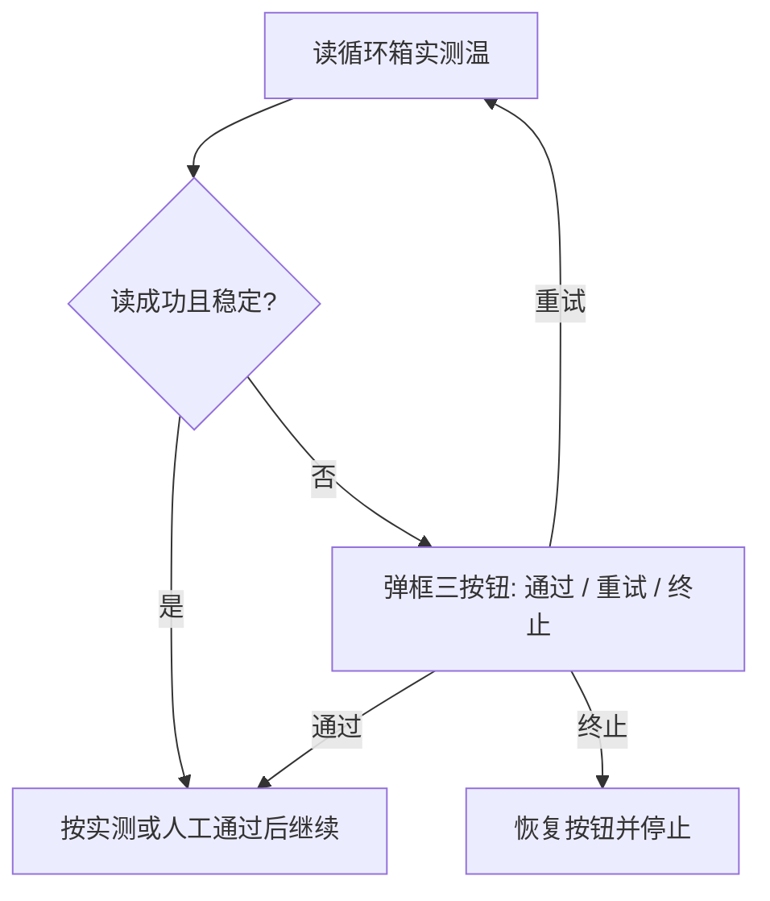

# TCC 禁止假定到温 + 三按钮人工确认

## 问题

[`TryReadChamberTemperature`](library/UIOperateInterleaverFinalTest/UIOperateInterleaverFinalTest/OperateInteleaverFinalTest.xaml.cs) 在 `GetCurrentTemp` 失败后把 `actual = assumedTmpt` 并 `return 0`；[`BeginChamberPrepOrScan`](library/UIOperateInterleaverFinalTest/UIOperateInterleaverFinalTest/OperateInteleaverFinalTest.xaml.cs) 仍设 `hasActualReading = true`，导致 **不烤温 + 校验假通过**，第二遍常温箱会按低温模板开扫。感叹号提示不足以拦截。

驱动更新由现场并行推进；本计划只改业务兜底：**禁止静默假定通过**；读不到时必须弹框由操作员显式选择。

## 锁定行为

弹框使用 `MessageBoxButton.YesNoCancel`（或等价三按钮），文案明确映射：

| 按钮 | 含义 | 行为 |
|------|------|------|
| **通过**（Yes） | 操作员目视确认箱温后强制放行（方便产线） | 记日志 `operator override`；**不**再静默伪造读数；本步校验视为人工通过 |
| **重试**（No） | 再读通讯/温度 | 回到读温循环 |
| **终止**（Cancel） | 中止本轮测试 | `RestoreUiOnChamberFail`，不开扫 |

要点：

- 自动路径：**绝不**再 `actual = assumedTmpt` 当成功。
- **通过**是显式人工授权，须写日志（含目标温、失败原因），与旧“静默假定”区分。
- 开扫前正常路径仍要求多次一致实测；仅弹框选「通过」时可跳过该次硬校验。
- 设点：`SetTempSetpoint` 后回读 setpoint 核对。

人工「通过」后的烤温策略（锁定）：无有效实测时按 `hasActualReading = false` 走现有 `IsBakeRequired`（用 `curTestTmpt` 与目标比），变温仍会烤温；避免「通过」后直接跳过变温烤温。

## 改动

### 1. 读温：去掉静默假定 + 三按钮

文件：[`OperateInteleaverFinalTest.xaml.cs`](library/UIOperateInterleaverFinalTest/UIOperateInterleaverFinalTest/OperateInteleaverFinalTest.xaml.cs)

- 重写 `TryReadChamberTemperature`：失败返回非 0，**删除** `actual = assumedTmpt` / `usedAssumed` 成功路径；通讯短重试可改为 3×1s。
- 新增带操作员确认的封装（名称自定），返回枚举或三态：`Success` / `OperatorPass` / `Abort`：
  - 失败弹框文案含目标温、错误信息，按钮：**通过 / 重试 / 终止**。
  - `OperatorPass`：打日志后继续后续流程（烤温判定用无实测分支）。
  - `Abort`：恢复 UI 并中止。
- `BeginChamberPrepOrScan`：仅真实读成功才 `hasActualReading = true`；去掉感叹号假定分支。

### 2. 开扫前：多次一致读数

- `TryValidateChamberTemperature`：连续 **3** 次读（间隔约 500ms）；均成功、均在目标 ±2°C、极差 ≤1°C 才自动通过；失败则同上三按钮（通过=本步放行开扫，重试=再校验，终止=停）。
- 调用点：`EnsureChamberReadyForTest`、`DoScanOnBK` 扫前校验。

### 3. 设点确认

- [`IUDLTCC.cs`](library/MolexUtility/Device/IUDLTCC.cs) 增加 `GetTempSetpoint`。
- [`UDLTccCtrl.cs`](library/DeviceControl/DeviceControl/TCC/UDLTccCtrl.cs) 实现。
- `TrySetChamberSetpoint`：设点后回读，不符则再设；仍失败返回 false。

### 4. 不改

- 一键/烤温计时骨架、扫描算法、IL 闸门、快扫 STA。
- `DisableTccChamberCheck.txt` 调试跳过逻辑保留。
- 驱动/固件升级不在本仓库范围。

## 验证

- 读失败弹框三按钮：终止不开扫；重试可恢复；通过可继续且日志有 override。
- 无实测选通过后，目标与当前逻辑温不同时仍会烤温（不静默跳变温）。
- 实测常温、目标低温：自动路径必须烤温。
- 烤温结束未到温：弹框；非「通过」则不开扫。
- 正常三温一键可跑通。
