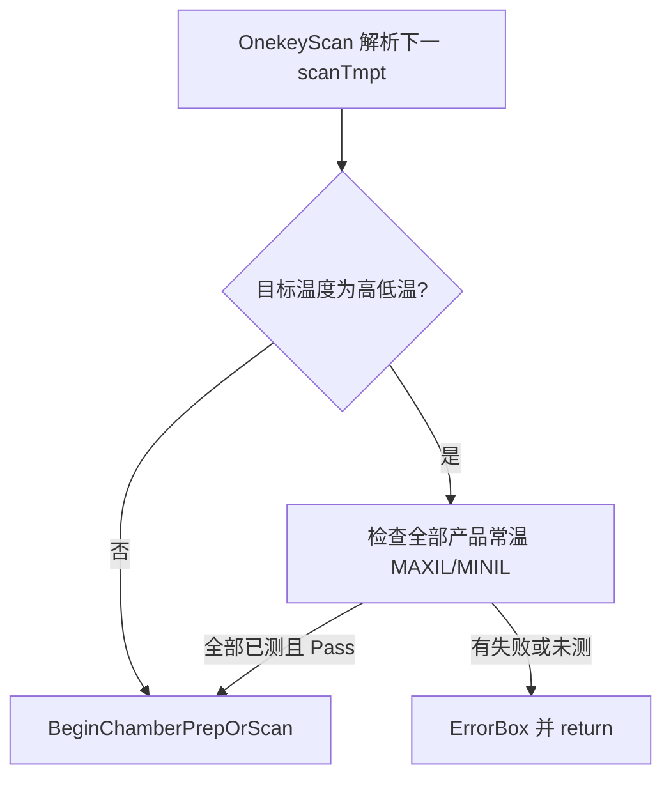

# 常温 MAXIL/MINIL 合格后方可高低温

## 背景

现有闸门 [`TryAbortBatchForRoomTempIl`](library/UIOperateInterleaverFinalTest/UIOperateInterleaverFinalTest/OperateInteleaverFinalTest.xaml.cs) **仅**在 1×16 多 SN 批次（`IsMultiSnSinglePortBatch`）常温扫完后整批终止。

三温一键在 [`OnekeyScan`](library/UIOperateInterleaverFinalTest/UIOperateInterleaverFinalTest/OperateInteleaverFinalTest.xaml.cs) 常温全部 `IsTested` 后会直接选下一温度并 `BeginChamberPrepOrScan`（烤温/扫描），**无**常温 IL 合格检查。

**已确认范围：** 仅 `MAXIL` / `MINIL`（与 `IsMaxMinIlParam` 一致）。

## 方案（已锁定）

在进入**非常温**（`!IsRoomTemperature(target)`，常温仍为 20~30°C）之前统一做闸门；不合格则 `ErrorBox`、恢复按钮、不继续。保留现有批次早停逻辑不变。

## 改动点（单文件）

文件：[`OperateInteleaverFinalTest.xaml.cs`](library/UIOperateInterleaverFinalTest/UIOperateInterleaverFinalTest/OperateInteleaverFinalTest.xaml.cs)

### 1. 扩展常温 IL 检查辅助方法

在现有 `TryGetRoomTempMaxMinIlFailure` / `IsMaxMinIlParam` 旁新增（或泛化）闸门方法，例如 `TryBlockHighLowTempForRoomTempIl(out string message)`：

- 遍历 `allProductControl` 全部 `MESTestInfo`
- 条件：`IsRoomTemperature(info.Temperature)` + `IsMaxMinIlParam(ExParamName)` + 总通道行（与现逻辑一致：`PortNameForUser` 无 `_` 分段、排除 `Frequency Range`）
- **不合格**：`Tested && !Pass` → 文案含 SN/端口/参数/实测/限值
- **未测完**：`!Tested` → 文案提示常温 MAXIL/MINIL 未测完，不能进高低温
- 全部常温 MAXIL/MINIL 已测且 `Pass` → 放行

`TryGetRoomTempMaxMinIlFailure` 可改为调用同一套按温度过滤的核心逻辑（批次早停仍只关心“已测失败”），避免两套判定分叉。

### 2. 一键三温：切到高低温前拦截

在 `OnekeyScan` 中，在已确定下一 `scanTmpt` 且准备 `BeginChamberPrepOrScan` **之前**（约现有 `scanDetailInfo.ScanType = TestWithPDLOnekey` / `BeginChamberPrepOrScan` 处）：

- 若 `!IsRoomTemperature(scanTmpt)` 且闸门失败 → `ErrorBox(...)`、`UIControl.IsScanEnable/IsSaveEnable = true`、`return`（不烤温、不扫）
- 成功则走原流程

提示文案建议：`常温 MAXIL/MINIL 未合格，不能进行高低温测试。` + 明细。

### 3. 单项高低温：同样拦截

在 `btnSingleScan_Click` 解析出目标温度后、开始扫描前：若目标为高低温且闸门失败 → `ErrorBox` 并 return（避免手动点低温/高温行绕过一键闸门）。已有 `IsBatchTestAbortedBlocked` 保留。

### 4. 不改动

- 批次 `TryAbortBatchForRoomTempIl` 仍可在常温扫完立刻整批终止
- RtOnly / TCC / 烤温逻辑不变
- 不新增配置开关（按需求默认强制）

## 验证（产线/调试）

- 常温 MAXIL 或 MINIL 故意超限 → 一键不应进入低温烤温；弹框后按钮可点
- 常温 IL 全合格 → 可正常烤温并测 LT/HT
- 常温未测完就选手动高低温行 → 弹框阻止
- 1×16 批次常温 IL 超限 → 原整批终止仍生效
