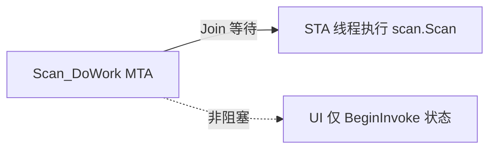

# 1×16 快扫 UI 卡死改善

## 根因（已锁定）

[`DoScan`](library/UIOperateInterleaverFinalTest/UIOperateInterleaverFinalTest/OperateInteleaverFinalTest.xaml.cs) 虽在 `BackgroundWorker` 中调用，却用 **同步** `Dispatcher.Invoke` 把整次 `scan.Scan`（含 `WaitForSweepCompletion` 轮询，常十余秒）拉回 UI：

```2655:2658:library/UIOperateInterleaverFinalTest/UIOperateInterleaverFinalTest/OperateInteleaverFinalTest.xaml.cs
this.Dispatcher.Invoke(() =>
{
    scanRes = scan.Scan(...);
});
```

1×16 串行时 UI 几乎一直被占满。

**约束：** 不改 Onekey/归零链式顺序、`ScanAndCalResultFSTP` 算法、光开关、烤温、IL 闸门、上传；只改线程边界与 UI 刷新方式。

## 方案



### 1. 最小高收益：FSTP 离开 UI 线程

文件：[`OperateInteleaverFinalTest.xaml.cs`](library/UIOperateInterleaverFinalTest/UIOperateInterleaverFinalTest/OperateInteleaverFinalTest.xaml.cs)

- 去掉 `DoScan` 两处对 `scan.Scan(...)` 的 `Dispatcher.Invoke`。
- 复用打开模板/上传已有模式：在 `DoScan` 内起 **`Thread` + `SetApartmentState(STA)`**，在 STA 线程调用 `IUDLFSTP.Scan`，主扫描线程 `Join` 等待结果（COM/UDL 与现有 TAS STA 策略一致；`UDLFSTPScan` 已有 `SweepWaitLock`）。
- STA 超时：不另加短超时；依赖 FSTP 内部 `WaitForSweepCompletion` 超时即可（避免误杀正常长扫）。
- `Scan_DoWork` 开头的 `Dispatcher.Invoke(UpdateProductStatuses)` 改为 **`BeginInvoke`**，避免再同步占 UI。
- **不改** `DoScan` 的入参/返回值语义与后续 `ScanAndCalResultFSTP` 读文件/计算路径。

### 2. 扫完后减轻列表压力

同一文件 `ParamItemUpdate`（非打开模板分支）：

- 现状：每个可见行都 `UpdateItem` → `EventListItemUpdate`；[`ListCommon.UpdateTestList`](library/UIListCommon/ListCommon.xaml.cs) 对已存在 SN 的 `EventTemplateUpdate` **不会刷新数值**，故不能改成整表 TemplateUpdate。
- 改法：
  - 内存里照常 `UpdateTestData`；
  - **仅当**实测值或 Pass 相对展示行有变化时才 `UpdateItem`；
  - 将本轮若干 `UpdateItem` 用 **`Dispatcher.BeginInvoke(..., Background)`** 打包执行，让 `ScanFinish` 能尽快进入下一轮 `OnekeyScan`，列表在下一扫等待期间刷完。
- `UpdateReferenceStatus` 保持逻辑不变（归零次数少）；若也逐行刷，可同样“有变化才发”。

### 3. 体验层（轻量）

- 每次真正开始扫前（`DoScanOnBK` / `OnekeyScan` 已禁用扫描按钮处）：`RealtimeMsg` 标明进度，例如 `扫描中 SN {当前}/{总数} …`（用 `CurProductIndex` / `allProductControl.Count`）。
- 扫描中继续禁用扫描/保存（现有逻辑）；**不新增**扫描链路中的 `MessageBox`；错误仍用现有 `ErrorBox`（仅在完成后 UI 线程弹出）。
- 不强制改鼠标光标，避免“假死感”与可点控件冲突。

## 明确不改

- `OnekeyScan` / `ScanRef` / `ScanFinish` 状态机与串行顺序
- `ScanAndCalResultFSTP`、`CalAllResultInThread`、参数算法
- `SetSwitch`、TCC 烤温、常温 IL 闸门、上传 STA

## 验证

- 1 SN：归零/一键/单项结果与改前一致
- 16 SN 一键：扫描等待期间主窗口可拖动、状态栏可更新；扫完数值仍正确写入列表
- 故意 FSTP 失败：仍弹出错误且可恢复按钮
- COM/STA：本机无 MTA 调 UDL 崩溃（对比打开模板 STA 经验）
