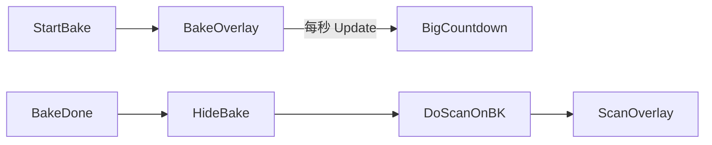

# 烤温倒计时等待框

## 目标

烤温开始即打开与快扫同款的主窗居中等待框；中间用**大号倒计时**（`mm:ss` / `hh:mm:ss`）替代「只有小字」。行为与快扫一致：**非模态**、`IsHitTestVisible=False`、不挡点击。

## 现状

| 环节 | 行为 |
|------|------|
| 烤温 | [`BakeTimeCheck_Progress`](library/UIOperateInterleaverFinalTest/UIOperateInterleaverFinalTest/OperateInteleaverFinalTest.xaml.cs) 每秒写 `TemptRemainTime`（约 14px） |
| 启动 | [`StartBakeAfterChamberPrep`](library/UIOperateInterleaverFinalTest/UIOperateInterleaverFinalTest/OperateInteleaverFinalTest.xaml.cs) 启 `bakeTimeCheckBK` |
| 结束 | `time==0` →「烤温完成」→ `DoScanOnBK()`（会再开快扫遮罩） |
| 遮罩 | [`ShowScanWaitOverlay`](library/UIOperateInterleaverFinalTest/UIOperateInterleaverFinalTest/OperateInteleaverFinalTest.xaml.cs) 仅快扫/归零；每次 Show 会 Detach 重建 |

## 方案

把现有遮罩收成**双模式共用一层**（不新建第二套 overlay）：

### 1. 重构遮罩结构（同一文件）

在 [`OperateInteleaverFinalTest.xaml.cs`](library/UIOperateInterleaverFinalTest/UIOperateInterleaverFinalTest/OperateInteleaverFinalTest.xaml.cs) 中扩展 `EnsureWindowScanWaitOverlay`（可改名为 `EnsureWaitOverlay`）：

- 保留：半透明背景挂 `rootGrid`、白卡片、无 `DropShadowEffect`
- 字段：`txtWaitTitle`、`windowScanWaitDetail`、**`txtWaitCountdown`**（大号，约 56–64）、不确定/确定 `ProgressBar`
- **Scan 模式**：标题「快扫进行中」；详情 `SN x/y`；隐藏大倒计时或清空；`IsIndeterminate=true`
- **Bake 模式**：标题「烤温倒计时」；详情如 `目标 55.0°C`；**大号剩余时间**；进度条改为**确定进度**（已烤/总时长）

`ShowScanWaitOverlay`：切到 Scan 模式后显示（仍可每次重建或切换内容，避免 Effect 缓存问题）。

新增：

- `ShowBakeWaitOverlay(double targetTmpt, int totalSeconds)` — 开烤时调用
- `UpdateBakeWaitOverlay(int remainSeconds, int totalSeconds)` — 每秒更新大字 + 进度 + 同步 `TemptRemainTime`
- `HideWaitOverlay()` — 与现有 `HideScanWaitOverlay` 合并或互相调用

**关键：** 烤温每秒更新**不得** Detach/重建整棵树（否则闪烁）；仅改 `Text` / `ProgressBar.Value`。切 Scan↔Bake 时再切换标题/显隐。

### 2. 挂钩烤温生命周期

| 时机 | 动作 |
|------|------|
| `StartBakeAfterChamberPrep` 真正 `RunWorkerAsync` 前后 | `ShowBakeWaitOverlay(targetTmpt, (int)(soakMinutes*60))` |
| `BakeTimeCheck_Progress`（`time>0`） | `UpdateBakeWaitOverlay` + 现有 `TemptRemainTime` |
| `BakeTimeCheck_Progress`（`time==0`） | 先 `HideWaitOverlay`，再「烤温完成」+ `DoScanOnBK` |
| `btnClearBakeSN_Click` / 中止烤温 / `Unloaded` | `HideWaitOverlay`；必要时 `CancelAsync` 烤温线程（保持现有清列表逻辑） |

倒计时格式与现有小字一致并修正可读性：剩余秒 → `hh:mm:ss`（小时也按实际算，不再写死 `"00"` 小时位若超过 60 分钟）。

### 3. 与快扫衔接

烤温结束 → Hide → `DoScanOnBK` → `ShowScanWaitOverlay("SN …")`，两段遮罩不重叠。

### 4. 不做的范围

- 不改循环箱「读温/设温中」文案为遮罩（仅烤温倒计时）
- 不改 XAML 小标签布局；`TemptRemainTime` 仍同步更新作兜底

## 部署

重编后部署 `module\UIOperateInterleaverFinalTest.dll`。
