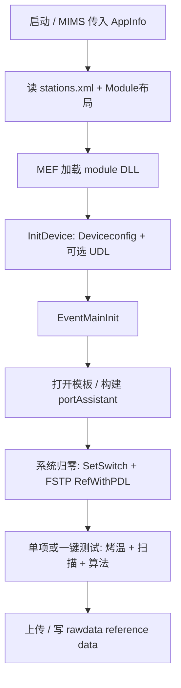

# SW2219 ITL FTS — AI 协作指南 (claude.md)

> **交织器（Interleaver）硬件自动化终测程序**  
> 仓库：`SW2219_ITL_FTS` · 宿主：**OCITS**（Optical Component Integrated Test System）  
> 产线形态：MIMS 模块启动 `SW2219_ITL_FTS.exe`，加载 MEF 插件执行业务与仪器控制。

---

## 1. 项目概览

### 1.1 是什么

本仓库是一套 **光器件产线/研发自动化测试桌面系统**，当前工位核心场景为 **Interleaver（交织器）终测（FTS, Final Test Station）**：

- 从无纸化/MES 加载测试模板，驱动 **光开关、功率计、FSTP 扫描仪、温控箱（TCC）** 等设备；
- 完成多产品、多端口 **PDL 扫描、系统归零、烤温、参数计算、曲线显示、结果上传**；
- 通过 **插件化 UI** 组合不同工位界面，同一套壳程序可复用于 Demux、CIR、1×8 PD 等其它产品线（对应不同 `UIOperate*` 模块）。

### 1.2 不是什么

- 不是 Web 服务或云原生应用；是 **.NET Framework WPF 单机 x86 程序**。
- 不是单一可执行文件：运行时依赖 `module\` 下大量 DLL 与 `set\` 下 XML 配置。
- 仪器协议与拓扑 **强依赖现场 XML/配置文件**，改代码前务必对照产线 `Deviceconfig.xml`、`switch\` 指令表。

### 1.3 核心业务模块（本工位）

| 模块 | MEF 名称 | 说明 |
|------|----------|------|
| **UIOperateInterleaverFinalTest** | `UIOperateInterleaverFinalTest` | 终测主业务：模板、归零、扫描、计算、上传 |
| UIListInterleaver / UIListCommon | 各模块 metadata | 测试项列表 |
| UICurve | `UICurve` | 频谱/曲线 |
| UIRealTimeStatus | `UIRealTimeStatus` | 实时状态 |
| ConfigModel | `IMenuPlugin` | 设置 → 设备配置 |
| DeviceControl | `IDeviceHandle` | 设备初始化与访问总线 |

更细的终测流程见：[doc/UIOperateInterleaverFinalTest_代码说明.md](doc/UIOperateInterleaverFinalTest_代码说明.md)。

---

## 2. 技术栈

| 类别 | 技术 |
|------|------|
| 语言 / 运行时 | C#，**.NET Framework 4.6.1 ~ 4.8** |
| UI | **WPF**（部分 WinForms 桥接，如 DataGridView） |
| 模块化 | **MEF**（`System.ComponentModel.Composition`） |
| 模块通信 | **ProtocolAggregator**（Prism 风格 `IEventAggregator` + 强类型事件） |
| 配置 | **XML**（GB2312 编码，`set\`、`module\`、`switch\`） |
| 仪器 | 串口 / **NI-VISA**、可选 **UDL2_Engine**、自研 **FastScanClentDLL**（C++ 扫描客户端） |
| 外部系统 | MIMS 启动参数、无纸化/AMTS（`FusionControl`）、MES |
| 构建 | Visual Studio 2019+，主平台 **x86** |
| 解决方案入口 | `project/OCITestSystem.sln`、`library/OCI Library.sln`、`library/ConfigModel/ConfigModel.sln` |

---

## 3. 架构与设计

### 3.1 分层结构

```
┌─────────────────────────────────────────────────────────────┐
│  APPLICATION                                                │
│  OCITestSystem (MainWindow) · SW2219_ITL_FTS.exe (产线入口)   │
├─────────────────────────────────────────────────────────────┤
│  PLUGIN 层 (MEF, 目录 module\*.dll)                          │
│  UIOperate* · UIList* · UICurve · ConfigModel · DeviceControl│
│  CommonAlgorithm · InterleaverAlgorithm                      │
├─────────────────────────────────────────────────────────────┤
│  INFRASTRUCTURE                                             │
│  ProtocolAggregator · MenuPluginInterface · MolexUtility     │
├─────────────────────────────────────────────────────────────┤
│  NATIVE / 第三方                                             │
│  FastScanClentDLL · UDL2 · NI-VISA · bin\common\*.dll        │
└─────────────────────────────────────────────────────────────┘
```

### 3.2 MEF 组合约定

- 宿主在 `MainWindow` 中对 `{exe}\module` 做 `DirectoryCatalog` + `ComposeParts`。
- UI 插件：`[Export(typeof(UserControl))]` + `[ExportMetadata("name", "模块名")]`。
- 布局：`module\Module_<工位类型>.xml` 中 `DockPanel Module="模块名"` 与 metadata **必须一致**。
- 菜单插件：`IMenuPlugin`（如 ConfigModel 的「设置 → 设备配置」）。
- 设备总线：单一 `IDeviceHandle` 实现（`DeviceHandle`）。
- 算法：`IInterleaverAlgorithm`、`IAlgotithm` 等可选导出。

### 3.3 事件总线（模块间解耦）

| 事件 | 用途 |
|------|------|
| `EventMainInit` | 广播 `MainInitInfo`（登录、MES、设备初始化结果） |
| `EventTemplateUpdate` | 模板路径/内容更新 |
| `EventListItemUpdate` | 列表行数据刷新 |
| `EventCurveUpdate` | 曲线数据 |
| `EventRealtimePowerUpdate` | 实时功率 |
| `EventRealTimeStatus` | 状态栏/状态列表 |
| `EventXml` | XML 字符串消息（`MsgXmlParser`） |

**原则：** UI 模块之间避免直接引用彼此；通过 `IEventAggregator` 或 `IDeviceHandle` 协作。

### 3.4 设备抽象（MolexUtility + DeviceControl）

- **接口**定义在 `library/MolexUtility/Device/`：`IPowermeter`、`IOpticalSwitch`、`IInterleaverScan`、`IFSTPScan`、`IUDLTCC` 等。
- **实现**在 `library/DeviceControl/DeviceControl/`：`DeviceHandle` 读取 `set\Deviceconfig.xml`，按 `Type` 实例化具体驱动。
- **光开关**继承 `OpticalSwitchBase`，指令来自运行目录 `switch\{ShowName}` 配置文件（非硬编码在 C#，便于改线）。

#### 光开关实现一览

| 类 | Deviceconfig Type | 协议特点 |
|----|-------------------|----------|
| SwitchMini1X8 | Min1X8Switch | 十六进制帧 `*...\r` + 校验和 |
| SwitchPbox | PboxSwitch | 同上 |
| SwitchOMS | OMSSwitch | ASCII + CRLF，`OK` 应答 |
| **SwitchMPLUS** | **MPLUSSwitch** | **RS232 MSW 协议**，ASCII + CRLF；ITL FTS **双盒**（入 1×16 / 出 1×32） |
| Switch3STD | （需配置） | 十六进制（工程内有，按工位选用） |
| UDLSwitch | UDLSwitch | 走 UDL 引擎 |

**MPLUS 双光开关（本工位，1×16 入 + 1×32 出）要点：**

- 驱动：`library/DeviceControl/DeviceControl/Switch/SwitchMPLUS.cs`
- 设备配置：光源盒 **两条** MPLUS — `interleaverSwitch-MPLUS-IN`（COM1）、`interleaverSwitch-MPLUS-OUT`（COM2）
- 指令表示例：`doc/switch/ITL_MPLUS_SW_IN.example`、`doc/switch/ITL_MPLUS_SW_OUT.example` → `{运行目录}\switch\{ShowName}`
- 入光 Flag：`产品序号::入通道:16`（如 `3::3:16`）；出光 Flag：`PM序号::出通道:32`（如 `1::5:32`）
- 入光 MSW（SW1 级联）：ch1~8 → `MSW 1,1,2;9,1,n`；ch9~16 → `MSW 1,1,1;10,1,n`；见 `doc/1X8.jpg`、`switch\interleaverSwitch-MPLUS-IN`
- 出光 MSW（SW1/SW2 级联）：ch1~8 → `1,1,2;9`；9~16 → `1,1,1;10`；17~24 → `2,1,2;11`；25~32 → `2,1,1;12`；见 `doc/1X16.png`、`switch\interleaverSwitch-MPLUS-OUT`
- **Demux 单 SN 双口**：入光均 `1::1:16`；出光 Even `1::1:32`、Odd `2::17:32`（模块9/11，非 `PORT2→ch2`）
- 切换时先入后出
- UI 端口名映射：`OperateInteleaverFinalTest` 中 `L3-4`…`L4-1` → 出通道 1–16

### 3.5 一次会话的主流程（终测）



---

## 4. 仓库目录（重组后）

```
SW2219_ITL_FTS/
├── project/                    # 可执行程序
│   ├── OCITestSystem/          # 主壳 WPF
│   └── OCITSAutoUpdate/        # 自动更新工具
├── library/                    # 全部类库与插件源码（已扁平化一层）
│   ├── MolexUtility/           # 接口、协议、工具、串口（*.csproj 在根下）
│   ├── ProtocolAggregator/
│   ├── MenuPluginInterface/
│   ├── DeviceControl/DeviceControl/  # 设备实现（注意仍有一层 DeviceControl）
│   ├── ConfigModel/ConfigModel/
│   ├── UIOperateInterleaverFinalTest/UIOperateInterleaverFinalTest/
│   ├── InterleaverAlgorithm/、CommonAlgorithm/
│   ├── UIList*、UICurve、RealtimePower、...
│   ├── InterleaverTestdll/     # C++ 快速扫描 DLL
│   └── OCI Library.sln         # 聚合多数 library 工程
├── bin/
│   ├── common/                 # MolexUtility、ProtocolAggregator 等公共 DLL
│   └── Debug/module/           # 各 UI 插件输出 DLL（部署到运行目录 module\）
├── doc/                        # 设计文档、拓扑图、协议参考、switch 示例
├── set/                        # 运行时配置（常不在仓库，产线本地）
├── switch/                     # 光开关指令表（运行时，可按 doc 示例复制）
├── module/                     # 运行时 MEF 插件与 Module_*.xml
└── README.md
```

**工程引用注意：** 类库路径已统一为 `library/MolexUtility/MolexUtility.csproj`（勿使用旧的 `MolexUtility/MolexUtility/` 双层路径）。优先用 **ProjectReference** 而非 `bin\common\*.dll` 的 HintPath。

---

## 5. 运行时配置（必读）

| 路径 | 编码 | 作用 |
|------|------|------|
| `set\stations.xml` | GB2312 | 产线、工位、主业务 DLL |
| `set\Deviceconfig.xml` | GB2312 | 设备实例：COM、波特率、Type、ShowName |
| `set\AllDevice.xml` | GB2312 | 设备配置 UI 可选类型清单 |
| `module\Module_<工位>.xml` | — | 主界面 Grid 与插件名 |
| `switch\{ShowName}` | UTF-8 文本 | 光开关路由指令（`[flag]` 块 + 命令行） |
| `set\UDLConfig.xml` | — | 可选 UDL；异常时可 `DisableUDLEngine.txt` 跳过 |

程序自动创建：`temple`、`reference`、`rawdata`、`data`、`lightdata`。

### 5.1 配置文件编码

`ConfigXmlParser`（ConfigModel / MolexUtility）使用 **GB2312（代码页 936）** 读写，与 XML 声明 `gb2312` 一致。修改 `AllDevice.xml` / `Deviceconfig.xml` 时请用 ANSI/GB2312 保存，避免中文乱码。

---

## 6. 构建与调试

### 6.1 推荐打开方式

- 全库：`library/OCI Library.sln`
- 仅设备配置插件：`library/ConfigModel/ConfigModel.sln`
- 主程序：`project/OCITestSystem.sln`

### 6.2 输出与部署

| 工程类型 | 典型输出 |
|----------|----------|
| MolexUtility、ProtocolAggregator、MenuPluginInterface | `bin\common\` |
| UI 插件、DeviceControl、ConfigModel | `bin\Debug\module\` 或 `bin\debug\module\` |

产线运行：将 `module\`、`bin\common\` 内容同步到 exe 同级的 `module\` 与 `common\`（或按现有部署包结构）。

### 6.3 单机调试

- `App.xaml.cs` 可能含 **硬编码测试用 AppInfo XML**；接 MIMS 时改为命令行参数。
- 无 UDL：`set\DisableUDLEngine.txt` 或移除/备份 `UDLConfig.xml`。
- 无硬件：仅能验证 UI 与配置加载，扫描/开关需串口或模拟环境。

---

## 7. 关键源码入口

| 场景 | 文件 |
|------|------|
| 主窗体 / MEF 根 | `project/OCITestSystem/OCITestSystem/MainWindow.xaml.cs` |
| 设备初始化 | `library/DeviceControl/DeviceControl/DeviceHandle.cs` |
| 设备配置 UI | `library/ConfigModel/ConfigModel/ConfigMain.xaml.cs` |
| 终测业务 | `library/UIOperateInterleaverFinalTest/.../OperateInteleaverFinalTest.xaml.cs` |
| 终测参数计算 | `.../ParamCal.cs`、`InterleaverScanResult.cs` |
| 光开关基类 | `library/DeviceControl/.../Switch/OpticalSwitchBase.cs` |
| MPLUS 开关 | `library/DeviceControl/.../Switch/SwitchMPLUS.cs` |
| 事件定义 | `library/ProtocolAggregator/Event*.cs` |
| 设备枚举 | `library/MolexUtility/Device/Devices.cs` |

---

## 8. 文档索引（doc/）

| 文档 | 内容 |
|------|------|
| [SW2219_ITL_FTS_设计文档.md](doc/SW2219_ITL_FTS_设计文档.md) | 总体架构、数据流、类职责 |
| [project_relationships.md](doc/project_relationships.md) | 工程依赖与分层、Excel 对照 |
| [UIOperateInterleaverFinalTest_代码说明.md](doc/UIOperateInterleaverFinalTest_代码说明.md) | 终测模块业务流 |
| [UIOperateInterleaverFinalTest_方法索引.md](doc/UIOperateInterleaverFinalTest_方法索引.md) | 方法级索引 |
| [vs code UIOperateInterleaverFinalTest_代码逻辑全解.md](doc/vs%20code%20UIOperateInterleaverFinalTest_代码逻辑全解.md) | 更细的代码走读 |
| [OpticalSwitchController.cs](doc/OpticalSwitchController.cs) | MPLUS/MSW 协议参考实现（独立服务用） |
| [switch/ITL_MPLUS_SW_IN.example](doc/switch/ITL_MPLUS_SW_IN.example) | 入光 16 路指令表示例 |
| [switch/ITL_MPLUS_SW_OUT.example](doc/switch/ITL_MPLUS_SW_OUT.example) | 出光 32 路×PM 指令表示例 |
| [set/Deviceconfig_ITL_FTS.example.xml](doc/set/Deviceconfig_ITL_FTS.example.xml) | 双 MPLUS 设备配置示例 |
| [物理拓扑图.png](doc/物理拓扑图.png)、[1X16.png](doc/1X16.png) | 光路示意 |
| [releaseDesc.md](doc/releaseDesc.md) | 产线 Release 目录说明 |

---

## 9. AI 修改代码时的约定

1. **最小改动**：只改与任务相关的文件；匹配现有命名与风格（含历史拼写如 `OperateInteleaver`、`Algotithm`）。
2. **设备与产线配置分离**：MSW 等命令优先改 `switch\` 配置，而非在 C# 写死路由表（除非 UI 映射必须）。
3. **接口契约**：新增设备类型需同时改 `Devices.cs`、`DeviceHandle.InitDeviceByConfig`、`AllDevice.xml`（或 `DeviceCatalogHelper`）、必要时 ConfigModel。
4. **MEF 名称**：新增 UI 插件时 `ExportMetadata("name", ...)` 与 `Module_*.xml` 一致。
5. **编码**：涉及 `set\` 下 XML 的读写保持 GB2312；`switch\` 指令文件 UTF-8 即可。
6. **平台**：仪器相关项目为 **x86**；勿改为 AnyCPU 除非明确需要。
7. **不要提交**：产线密钥、`set\` 现场私密配置、大型 `savetmp.xml` 类运行缓存。

---

## 10. 常见问题

| 现象 | 处理 |
|------|------|
| VS 引用黄叹号 MenuPluginInterface / MolexUtility | 检查 ProjectReference 是否指向 `library/MolexUtility/MolexUtility.csproj`；重建 `OCI Library.sln` |
| 设备配置中文乱码 | `AllDevice.xml` 用 GB2312；已修复 ConfigXmlParser 读写编码 |
| UDL DevKey1 解析失败 | 换匹配版本 `UDLConfig.xml` 或 `set\DisableUDLEngine.txt` |
| 光开关切换失败 | 查 `switch\{ShowName}`、COM/波特率、`Deviceconfig` 中 Type=MPLUSSwitch |
| 找不到插件界面 | 查 `module\` 是否有对应 DLL；`Module_*.xml` 中 Module 名与 ExportMetadata 是否一致 |
| 测试提示循环箱未配置/无 TCC、仅需 RT | 运行目录 `set\` 建空文件 `DisableTccChamberCheck.txt`、`RtOnlyTest.txt`；见 [doc/ITL_FTS_rt_only_no_tcc.md](doc/ITL_FTS_rt_only_no_tcc.md) |

---

## 11. 版本与归属

- 内部 Molex/Oplink 光器件测试框架，版权与发布策略以组织规定为准。
- 本文件随仓库演进更新；重大架构变更请同步 [doc/SW2219_ITL_FTS_设计文档.md](doc/SW2219_ITL_FTS_设计文档.md)。
