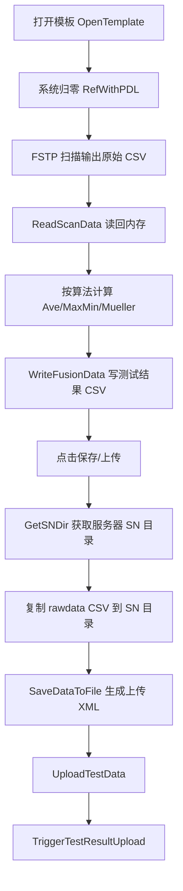
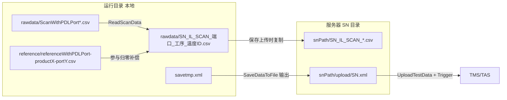

# ITL FTS 终测核心数据流

本文只描述 Interleaver Final Test 的主路径数据流：从扫描到结果上传。

## 1. 核心主链路（Scan -> UploadTestData）

## 2. 落盘与文件名图示

## 3. 关键目录与文件约定

- 本地扫描原始文件：`rawdata/ScanWithPDLPort*.csv`
- 本地归零参考文件：`reference/referenceWithPDLPort-product{产品序号}-port{端口号}.csv`
- 本地测试结果文件：`rawdata/{SN}_IL_SCAN_{端口名}_{工序}_{温度ID}.csv`
- 服务器归档结果文件：`{snPath}/{SN}_IL_SCAN_*.csv`
- 最终上传 XML：`{snPath}/upload/{SN}.xml`

## 4. 终测关注点（数据一致性）

- 归零参考与测试扫描要使用同一波段和步进，否则会导致补偿失真。
- `savePathList` 决定哪些本地 CSV 会被复制到服务器 SN 目录。
- 上传前若未写入软件信息、测试类型、权限等级，`SaveDataToFile` 会失败。
- `UploadTestData` 成功后仍需 `TriggerTestResultUpload` 成功，才算产线结果完成上报。
