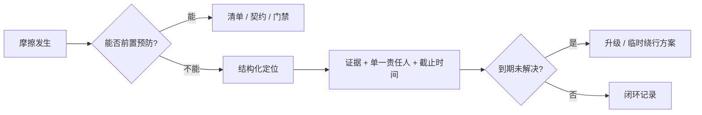

# Project 过程中的协作负面摩擦以及应对策略

> 经验总结：在 SW2219 ITL FTS 等产线测试类项目开发中，因协作边界不清、责任未闭环、环境未就绪导致的返工与拉扯，以及可操作的应对方式。

---

## 1. 背景与核心矛盾

这类项目的特点决定了协作摩擦很难完全避免：

- **强依赖现场**：`Deviceconfig.xml`、`switch\` 指令表、串口拓扑、仪器固件版本，任一环节未对齐都会导致「代码没问题但测不通」。
- **多角色并行**：软件、硬件/光路、产线工艺、MES/无纸化、现场运维各自有优先级，**关注点天然不一致**。
- **问题表象在开发侧**：环境没搭好、配置漏改、仪器未上电，最终往往由正在写代码或联调的人最先撞上，看起来像「开发 bug」，实则是上游未交付。

个人开发中最耗时的，往往不是写逻辑本身，而是：

1. 反复定位「到底是谁的问题」；
2. 定位到责任人后，还要**推动对方行动**；
3. 对方推进慢或推不动时，自己被迫兜底或等待，导致计划外返工。

---

## 2. 常见负面摩擦类型

### 2.1 环境/前置条件未就绪

**典型现象**

- 开始联调或测试时，运行目录缺 `set\`、`switch\`、DLL 部署不完整；
- 光开关 COM 口、波特率、ShowName 与现场不一致；
- TCC、功率计、FSTP 等仪器未接或未开机；
- MIMS 启动参数、模板路径、无纸化接口未打通。

**代价**：开发者在业务代码与基础设施之间来回切换，大量时间花在「证明不是我这边的错」上。

### 2.2 能力或责任心参差不齐

**典型现象**

- 交付物缺少最小可验证说明（没有「怎么算完成」）；
- 问题复现信息不全，需要多轮追问；
- 承诺的时间点反复推迟，且无书面更新；
- 只完成「自己理解的那一半」，与上下游接口假设不一致。

**代价**：沟通轮次指数增长，信任下降，最后往往变成「靠谱的人全包」。

### 2.3 关注点不一致

| 角色常见关注点 | 开发侧常见关注点 |
|----------------|------------------|
| 按期上线、少改需求 | 逻辑正确、可维护、可复现 |
| 现场先跑起来 | 配置与代码版本一致、可回归 |
| 单点问题快速绕过 | 根因闭环、避免下次再踩 |
| 文档/流程能省则省 | 变更可追溯、新人能接手 |

**没有对错，只有未对齐**——但未对齐时，摩擦会落在正在集成的那个人身上。

### 2.4 「拉扯」：责任边界模糊

典型对话循环：

1. A：我这边代码/逻辑没问题，你查环境。
2. B：环境是按文档配的，你查程序。
3. C：仪器厂家/网络/MES 那边还没好。
4. 无人牵头汇总证据，会议开完仍无**单一责任人**和**下一步截止时间**。

---

## 3. 真实案例：测试开发时环境未搭建完成

**场景（抽象自实际经历）**

某次进入测试/联调阶段，预期是「拉模板 → 归零 → 扫描」走通。实际却是：

- 程序启动后设备初始化失败或光开关无响应；
- 自行排查：代码路径、`Deviceconfig`、DLL 版本、串口占用；
- 对照 `doc/set/Deviceconfig_ITL_FTS.example.xml`、`doc/switch/` 示例，发现现场配置与约定不一致或文件缺失；
- 追问一圈才确认：**环境搭建责任人**尚未按清单交付，或交付了但未通知联调方；
- 直到点名责任人、对方被推动后，缺项才陆续补上——此前数小时乃至数天消耗在「定位 + 等待 + 重复验证」上。

**本质问题**

| 表面问题 | 根因 |
|----------|------|
| 测不通 | 联调前置条件（Definition of Ready）未定义或未验收 |
| 反复定位 | 缺少环境责任人与检查清单 |
| 推动慢 | 无升级路径，问题停留在私聊里 |
| 开发返工 | 在不稳定环境中改代码，把环境噪声当成软件缺陷 |

**若当时具备的做法（事后归纳）**

1. **联调前**：用一页纸「环境就绪检查表」双方签字（或群里明确回复「已就绪」），未勾选项不得开联调会。
2. **问题单**：第一条就写「环境项未满足：缺 xxx」，附截图/日志，**指派环境 Owner**，而非默认开发继续深挖代码。
3. **时间盒**：环境类阻塞超过 N 小时未进展，按升级路径拉组长/项目经理，避免个人无限拉扯。

---

## 4. 应对策略总览



策略分三层：**预防**（减少发生）、**处置**（缩短拉扯）、**沉淀**（避免重复）。

---

## 5. 预防：把协作成本写进流程

### 5.1 定义「就绪」——联调/测试门禁

在动手联调前，明确 **Definition of Ready（DoR）**，例如 ITL FTS 最小集：

- [ ] 运行目录结构完整：`module\`、`common\`、`set\`、`switch\`
- [ ] `Deviceconfig.xml` 与现场仪器一致（COM、Type、ShowName）
- [ ] `switch\{ShowName}` 与 `doc/switch/*.example` 或产线核定版一致
- [ ] 关键 DLL 版本与构建记录一致（如 `MolexUtility`、`UIOperateInterleaverFinalTest`）
- [ ] 仪器上电、串口未被占用
- [ ] 模板路径、MIMS/无纸化参数（若需要）已确认
- [ ] **环境 Owner 姓名**与**就绪确认时间**（消息或邮件）

**原则**：未就绪不开始「业务逻辑缺陷」排查；避免在脏环境里改代码。

### 5.2 接口契约书面化

对跨角色依赖，避免口头约定：

| 交付物 | 建议包含 |
|--------|----------|
| 环境搭建 | 目录截图、配置 diff、仪器清单、联系人 |
| 配置变更 | 改了哪个文件、为何改、影响哪些端口/通道 |
| 版本发布 | 构建号、DLL 列表、升级/回滚步骤 |
| 现场问题 | 复现步骤、日志片段、期望 vs 实际 |

仓库内已有技术文档（如 `CLAUDE.md`、`doc/ITL_FTS_rt_only_no_tcc.md`）可作为**开发侧标准**；现场侧应有一份对应的 **「现场就绪清单」**，两边字段对齐。

### 5.3 责任矩阵（RACI 简化版）

对高频依赖项指定唯一 **R**（Responsible，执行责任人）：

| 事项 | R | A（最终问责） | C（咨询） | I（知会） |
|------|---|---------------|-----------|-----------|
| 运行目录与 DLL 部署 | 现场/运维 | 工位负责人 | 开发 | 测试 |
| Deviceconfig / switch | 现场或指定配置员 | 工位负责人 | 开发 | — |
| 业务代码与插件 | 开发 | 开发负责人 | 算法/工艺 | 现场 |
| MIMS/MES 对接 | 对接人 | 项目经理 | 开发 | 现场 |

**关键**：每一项在问题单里必须能填出一个 **R 的名字**，不能是「大家」「现场」。

### 5.4 固定节奏，减少「突然联调」

- 短周期同步（如 15 分钟站会）：只报 **阻塞项 + 责任人 + 明天之前要什么**。
- 联调窗口预约：提前 1～2 天发 DoR 检查表，现场确认后再占开发时间。

---

## 6. 处置：缩短「定位—拉扯」周期

### 6.1 结构化问题单（避免空对空）

每条阻塞建议固定格式：

```
【现象】一句话 + 日志/截图
【影响】阻塞哪条测试/哪个里程碑
【已排除】开发侧已验证项（附命令/路径）
【判断】环境 / 配置 / 仪器 / 代码 / 外部系统（五选一为主）
【责任人 @姓名】
【请求】具体动作（非「帮忙看看」）
【截止时间】
```

示例：

> 【判断】环境  
> 【已排除】本地 Ref 扫描逻辑、当前 DLL 与 git tag 一致  
> 【责任人 @张三】补齐 `switch\interleaverSwitch-MPLUS-OUT` 并与 `doc/switch/ITL_MPLUS_SW_OUT.example` 核对  
> 【截止】今日 17:00 前确认，否则联调暂停

### 6.2 时间盒定位法

为自己设定上限，防止无限自证：

1. **30～60 分钟**：按检查表自检（配置、部署、日志）。
2. **仍不明**：发问题单，**停止改业务代码**，除非已排除环境。
3. **4 小时无进展**：升级；附时间线（何时发现、问了谁、答复是什么）。

这能保护开发节奏，也让对方感到「再拖有代价」。

### 6.3 证据优先，对人其次

- 用 **文件 diff、串口日志、初始化返回值** 说话，减少主观争论。
- 会议前先发异步材料；会上只决 **责任人 + 截止 + 是否升级**。
- 对「能力差」的合作者：把请求拆成 **逐步可勾选的小步骤**，降低理解负担，而不是一次抛整个系统。

### 6.4 升级路径（提前说好）

与负责人约定：

- 阻塞 **> 4 小时**（或影响当日里程碑）→ 工位/项目经理；
- 涉及安全、产线停线风险 → 立即升级；
- 升级时带 **问题单 + 时间线**，不是情绪投诉。

个人不必独自承担「推动全项目」的心理压力；**升级是流程的一部分**。

### 6.5 临时绕行 vs 根因修复

现场有时必须先「跑起来」：

| 类型 | 做法 | 风险 |
|------|------|------|
| 临时绕行 | 如 `DisableTccChamberCheck.txt`、`RtOnlyTest.txt` 等已文档化的模式 | 需明确「非产线最终态」 |
| 根因修复 | 配置/环境按清单补齐 | 耗时但可重复 |

**规则**：绕行必须 **记录在 issue/邮件**，写明谁、何时、恢复产线条件；避免临时方案变成永久债务。

---

## 7. 沉淀：把一次摩擦变成下次的门禁

每次因协作导致的返工，花 15 分钟做 **迷你复盘**：

1. **触发点**：什么前置条件缺失？
2. **检测太晚的原因**：为何联调开始才发现？
3. **一条改进**：加 checklist / 改 RACI / 补文档 / 加 CI 或部署脚本？

本仓库已积累的技术文档（设计说明、RT-only 模式、switch 示例）就是「沉淀」的一种；协作侧可平行维护 **《联调就绪检查表》** 与 **《常见问题责任归属表》**。

---

## 8. 个人边界与心态（长期可坚持）

1. **区分「我的专业义务」和「别人的交付义务」**  
   愿意协助定位环境是职业素养；在环境未就绪时持续改代码不是高效做法。

2. **默认善意，但用流程约束**  
   责任心差的人往往不是恶意，而是优先级不同或能力缺口；流程（清单、截止、升级）比反复说服更有效。

3. **保护专注时间**  
   联调日与环境 Owner 对齐时段；其余时间做可离线推进的开发（单元逻辑、文档、模拟数据），减少被随机打断。

4. **留下可追溯记录**  
   关键确认留在邮件/工单/群公告，避免「当时说过」的争议；这对绩效与复盘都有用，也减轻个人委屈感。

5. **不必赢得每一场争论**  
   目标是 **里程碑和可重复交付**；有时通过升级换资源，比技术上说服对方更省总时间。

---

## 9. 速查：遇到阻塞时怎么做

| 步骤 | 动作 |
|------|------|
| 1 | 对照 DoR 检查表，勾选已满足 / 未满足项 |
| 2 | 若环境项未满足 → 问题单指派环境 R，暂停业务深挖 |
| 3 | 问题单含证据、请求、截止时间 |
| 4 | 时间盒到期 → 升级，附时间线 |
| 5 | 解决后更新 checklist 或 doc，写一句「下次如何预防」 |

---

## 10. 附录：联调就绪检查表（可复制）

**项目**：____________　**日期**：____________　**环境 Owner**：____________　**开发联调人**：____________

| # | 检查项 | 通过 | 备注 |
|---|--------|------|------|
| 1 | exe 运行目录 `module\`、`common\` 齐全 | ☐ | |
| 2 | `set\Deviceconfig.xml` 与现场仪器一致 | ☐ | |
| 3 | `switch\` 下 IN/OUT 指令表已部署且版本已知 | ☐ | |
| 4 | 光开关/功率计/FSTP/TCC 上电与 COM 可用 | ☐ | |
| 5 | 模板路径 / MIMS 参数（若需要） | ☐ | |
| 6 | 本次构建 DLL 版本号：____________ | ☐ | |
| 7 | 双方确认「可以开始业务联调」 | ☐ | 确认人/时间： |

---

## 11. 小结

协作负面摩擦在产线测试类项目中几乎不可避免：**关注点不同**是常态，**能力差或责任心不足**是现实变量。有效做法不是指望所有人立刻变好，而是：

- **前置**：就绪清单、责任到人、书面契约；
- **事中**：结构化问题单、时间盒、证据、升级；
- **事后**：迷你复盘、文档与门禁。

这样可以把「不断定位、定位到责任人才能推动一下」的被动模式，逐步变成「未就绪不进联调、阻塞有主责有时限」的主动模式，减少因协作导致的返工与个人消耗。

---

*文档随项目实践更新；可与 `doc/releaseDesc.md`、现场运维 SOP 交叉引用。*
