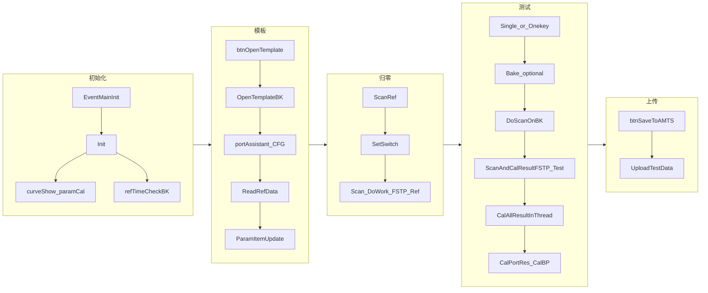
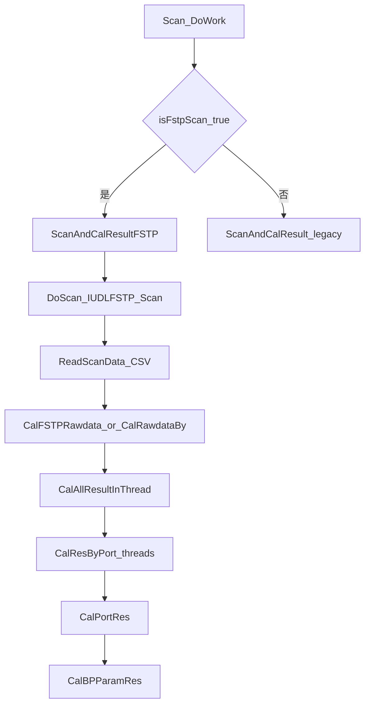

# UIOperateInterleaverFinalTest 工程代码说明

本文档说明仓库内 **Interleaver 终测** WPF 插件工程 `UIOperateInterleaverFinalTest` 的职责、依赖、业务流程、核心数据结构，并按类归纳方法行为。**方法级行号索引**见附录：[UIOperateInterleaverFinalTest_方法索引.md](./UIOperateInterleaverFinalTest_方法索引.md)。

---

## 1. 工程定位与依赖

### 1.1 在 OCITS 中的角色

- **输出**：类库（`.dll`），默认输出路径 `bin\debug\module\` 或 `bin\release\module\`（见 `.csproj`）。
- **装载方式**：MEF  
  - `[Export(typeof(UserControl))]`  
  - `[ExportMetadata("name", "UIOperateInterleaverFinalTest")]`  
  主程序 `Module_<工位>.xml` 中 `DockPanel` 的 `Module` 属性需与此 **metadata 名称**一致。
- **主要职责**：无纸化模板加载（`FusionControl`）、多产品/多端口 PDL 扫描与归零、FSTP 扫描、通道参数与总端口参数计算、曲线与列表联动、烤温（TCC）、结果上传与 raw 数据归档。

### 1.2 项目与源文件

| 文件 | 说明 |
|------|------|
| [OperateInteleaverFinalTest.xaml.cs](../library/UIOperateInterleaverFinalTest/UIOperateInterleaverFinalTest/OperateInteleaverFinalTest.xaml.cs) | 主 `UserControl` 逻辑（约 3300 行）及 `UIVariable`、`TestProductInfo`、`PortAssist` |
| [OperateInteleaverFinalTest.xaml](../library/UIOperateInterleaverFinalTest/UIOperateInterleaverFinalTest/OperateInteleaverFinalTest.xaml) | 界面布局与事件绑定 |
| [ParamCal.cs](../library/UIOperateInterleaverFinalTest/UIOperateInterleaverFinalTest/ParamCal.cs) | 通道/总端口参数计算；`SamePortParamData`、`SCANTYPE`、`ScanDetail` |
| [InterleaverScanResult.cs](../library/UIOperateInterleaverFinalTest/UIOperateInterleaverFinalTest/InterleaverScanResult.cs) | 扫描/归零 CSV 读写与四偏振融合算法 |
| [InterleaverFinalTestCurve.cs](../library/UIOperateInterleaverFinalTest/UIOperateInterleaverFinalTest/InterleaverFinalTestCurve.cs) | 通过事件总线驱动曲线控件 |

### 1.3 外部程序集（引用）

- **MolexUtility**：`FusionControl`、`IniParser`、`CommonFunction`、`MESTestInfo`、`MainInitInfo`、`RealtimeStatusInfo`/`StatusType`、`CurveUpdateDetail`、`ItemContent`、`IndexMap`、`AMTSRawdata` 等。
- **ProtocolAggregator**：`IEventAggregator`、`EventMainInit`、`EventTemplateUpdate`、`EventListItemUpdate`、`EventListSelectChanged`、`EventCurveUpdate`、`EventRealTimeStatus`、`EventXml`。
- **MenuPluginInterface**：工程引用存在；本模块 UI 代码中未直接使用菜单插件接口。
- **MEF**：`System.ComponentModel.Composition`，运行时再次 `Compose` 以解析 `[Import]`。

### 1.4 设备与扫描抽象（经 `IDeviceHandle`）

- **光开关**：`GetSwitchByIndex(1, …)` → `IOpticalSwitch.SetSwitch(flag, …)`，`flag` 格式 `产品序号::端口名:SWMaxPortFlag`。
- **FSTP 扫描**：`GetUDLFstpByGUID(2, …)` → `IUDLFSTP.Scan(...)`，在 UI 线程 `Dispatcher.Invoke` 内调用。
- **TCC 温控**：`GetUDLTCCByGUID(TCC_GUID=1, …)` → 设置/读取温度、上传成功后回 `25℃`。
- **功率计路数**：首产品打开模板后，从 FSTP 的 `PowermeterCount()` 更新 `scanPowermeterCount`（逻辑上影响多 PM 路径；当前 FSTP 主路径以单组合 CSV 为主）。

---

## 2. 核心业务流

### 2.1 文字概述

1. **主程序广播 `EventMainInit`** → 本控件 `Init(MainInitInfo)`：MESLESS 账号、构 `curveShow`/`paramCal`、拼接 `reference`/`rawdata` 绝对路径、设备初始化失败则提示；成功则读 FSTP 功率计数并 **启动归零计时 `refTimeCheckBK`**。
2. **用户输入 SN →「打开模板」**：金样校验、`FusionControl.OpenTemplate`，解析模板 CFG（频率范围、PASSBAND、算法、GROUP 扫描组、REF 起止波长、PDL 步进等），构建 `portAssistant`、`_scanList`、`portAndPMDic`，初始化曲线轴；**尝试 `ReadRefData` 加载已有归零**；发布模板/列表事件。
3. **「系统归零」**：按端口顺序弹窗确认 → `SetSwitch` → `BackgroundWorker`：`Scan_DoWork` → **当前固定 FSTP 路径** `ScanAndCalResultFSTP`（`RefWithPDL`）→ 写 `reference\referenceWithPDLPort-product{n}-port{p}.csv`；`ScanFinish` 链式继续下一端口 `ScanRef`。
4. **「单项测试」**：依赖列表选中项（`EventListSelectChanged`）；检查组内端口已归零；`BeginChamberPrepOrScan`（必要时 `SetTempSetpoint` + `bakeTimeCheckBK` 拷温）→ `DoScanOnBK` → 扫描完成后 **多线程 `CalResByPort`**，再 **`CalPortRes`/`CalBPParamRes`**，更新列表与通过图标。
5. **「一键测试」**：`OnekeyScan` 自动挑选未测端口与温度；同样经 `BeginChamberPrepOrScan` 设温/拷温/扫描链；扫描类型为 `TestWithPDLOnekey`，成功后 **递归调用 `OnekeyScan`** 直至全部完成。
6. **「上传数据」**：rawdata 文件复制到 SN 目录、写权限与软件信息、`FusionControl.UploadTestData`；成功后清空产品与状态，TCC 回常温。

### 2.2 流程图（总览）

### 2.3 扫描与计算子流程（FSTP 当前主路径）

说明：`Scan_DoWork` 内 `isFstpScan` 固定为 `true`，故 **`ScanAndCalResult`（四偏振多文件 + Mueller 分支）在当前构建中不会被调用**；`DoScan` 中 `isFSTP` 亦为 `true`，旧 `IInterleaverScan` 分支保留为死代码式备份。

---

## 3. 核心数据、路径与枚举

### 3.1 内存缓冲维度（与注释一致）

| 变量 | 含义 |
|------|------|
| `portResData[i]` | `double[6][]`：0 波长、1 平均 IL、2 PDL、3 MaxIL、4 MinIL、5 频率 |
| `pdlRawData[0..3]` | 四偏振下 `double[3][]`：0 波长、1 IL、2 频率（**非 FSTP 路径**使用） |
| `portPDLRef[i]` | `double[7][]`：带 PDL 归零；0 WL、1 ave、2–5 四偏振 IL、6 频率 |

### 3.2 磁盘路径约定（均相对 `Environment.CurrentDirectory`，在 `Init` 中转为绝对路径）

| 常量/模式 | 用途 |
|-----------|------|
| `reference\referenceWithPDLPort-product{n}-port{p}.csv` | 带 PDL 归零数据 |
| `rawdata\ScanWithPDLPort{pm}.csv` | FSTP 扫描输出（归零/测试共用前缀） |
| `rawdata\{SN}_IL_SCAN_{端口名}_{工序}_{TmptID}.csv` | 测试曲线归档（`WriteFusionData`） |
| 网络 `savePathBase`（INI） | `GetSNDir` 根路径，上传时复制 rawdata |

### 3.3 枚举

- **`ConvertAlgorithm`**（`OperateInteleaverFinalTest` 内）：`Ave` / `MaxMin` / `Mueller`，`Additional` 与模板 CFG `Algorithm` 字符串对应（如 `Muellermatrix`）。
- **`BakeStatus`**：`UnBake` / `Baking` / `BakeComplete`（逻辑上部分由烤温线程与 UI 推断）。
- **`SCANTYPE`**（`ParamCal.cs`）：`RefWithNoPDL`、`RefWithPDL`、`TestWithNoPDL`、`TestWithPDL`、`TestWithPDLOnekey`。本模块活跃使用 **`RefWithPDL`、`TestWithPDL`、`TestWithPDLOnekey`**。

### 3.4 `ScanDetail`（与 `OperateInteleaverFinalTest` 中字段 `scanDetailInfo`）

- `ScanType`：`SCANTYPE`
- `Ports`：本次扫描涉及的 **物理端口 index 列表**（可多个端口同扫）
- `ProductIndex`：从 **1** 开始的产品序号（与 `portAssistant.ProductIndex` 一致）

---

## 4. 类说明：InterleaverFinalTestCurve

**职责**：把本模块的曲线需求转成 `ProtocolAggregator` 的 `EventCurveUpdate`（`CurveUpdateDetail`）。

| 方法 | 行为要点 |
|------|----------|
| `InitAllCurve` | 若曲线名集合或频率范围变化，则对每条曲线调用 `InitCurve`，X 轴标题 `GHz`，Y 轴 `dB`，默认全频段 `entireFreLeft/Right`。 |
| `UpdateCurveShow` | `CurveUpdate.AllPoint`，`TargetName` 固定 `EntireArea`。 |
| `UpdateFre` | 更新内部左右频率后带 `isFreChanged:true` 重 init。 |
| `ClearAllCurve` | 对各 series 送空点列表。 |
| `InitCurve`（private） | `CurveUpdate.Init`，设置颜色、线型、`XScaleCount` 等。 |

---

## 5. 类说明：InterleaverScanResult

**职责**：CSV 与 `double[][]` 缓冲之间的转换，以及四偏振 / FSTP 的数值融合。

**返回值约定**（`Read*` 系列）：`0` 成功，`1` 文件缺失或格式不足，`2` 异常（`errMsg` 追加类型与方法名）。

| 方法 | 行为要点 |
|------|----------|
| `ReadRefTime` / `ReadRefPortCount` / `ReadRefSpec` | 读归零文件 **首行** CSV：字段含时间、Spec、端口数（与 `WritePDLRefData` 标题行一致）。 |
| `CheckRefRight` | 无 PDL 归零：检查 IL 是否过弱（&lt; -25 dB）。 |
| `ReadScanData` | 先 `InitRawdataBuffer`，按文件行数分配，再 `ParserRawdata` 填充。 |
| `WritePDLRefData` | 标题 `WL,Power,{时间},{spec},{portCount}`，数据行从高波长到低波长写入。 |
| `CalPDLRefData` | 四路原始扫描合成 **7 行** 归零缓冲（含四偏振分量）。 |
| `CalRawdataByAve` / `ByMaxMin` / `ByMueller` | 测试数据相对归零：逐波长对齐；Mueller 分支在光弱于 -10 dBm 时回退 max-min PDL。 |
| `CalFSTPRawdata` | FSTP：单文件结果相对归零 **ave** 做 IL 扣减，并同步 max/min 行。 |
| `CalRawdataByNoPDL` | 单通道无 PDL 参考时的扣减（备用路径）。 |
| `WriteCalData` / `WriteFusionCalData` / `WriteFusionData` | 导出计算后曲线或带头信息的融合格式。 |
| `InitRawdataBuffer` | `pointCount==-1` 时 `Array.Clear`；否则按点数 `new double[pointCount]` 每行。 |
| `ParserRawdata`（private） | 从流中解析数值填充 `rawdata` 各行。 |

---

## 6. 类说明：ParamCal 与相关类型

### 6.1 `ParamCal`

- **构造**：注入 `IInterleaverAlgorithm`（与主控件 `[Import]` 的算法实例一致）。
- **`CalChannelTestParam(param, minFre, maxFre, resData, borderData, ituFre, productFre, ref errMsg)`**  
  - `param` 形如 **`关键字@配置`**：`配置` 内用 **`;`** 分段，**`PB=`** 表示通带（或 **`ITU`**），**`DH=`** 表示深度（dB）。  
  - `resData`：六行缓冲（见 3.1）；若存在相邻端口数据 `borderData`，`STOPBAND` 等会用到 **邻道** `borderData[1]`。  
  - **支持的关键字（节选）**：`MAXIL`、`MINIL`、`PDL`、`RIPPLE`、`SHIFT`、`ADJ`、`NONADJ`、`NONADJ_ISO`、`ADJ_AVG`、`ADJ_ISO`、`ADJ_SHIFT`、`CT`、`STOPBAND`、`HBW_*`、`BW` 等；多数成对取 TE/TM（索引 3/4）再比较取优。  
  - 返回值一般为算法结果取负或取对数后的 **工程约定单位**（与 `InterleaverAlgorithm` 实现一致）。

- **`CalPortParam(param, temperature, port, records, tmptArray, ref errMsg)`**  
  - 面向 **总端口一行**（`PortNameForUser` 无 `_频率_port` 后缀）：从 `SamePortParamData` 聚合子通道结果。  
  - **典型关键字**：`MAXSHIFT`/`MINSHIFT`（基于 `SHIFT@` 记录）、`UNI`、`UNIPDL`、`WDL`、`MAXNONISO`/`MINNONISO`、`MAXISO`/`MINISO`、`TDL`（用 `tmptArray` 三温点 `MAXIL`）、`FSR`、`MAXBW`、`MINPEAKIL`，以及 `else` 分支对多频点 `GetMaxMin`。  
  - `_BP` 类参数不在此计算，而在 **`CalBPParamRes`**。

- **`GetRecordResultByParamName`**：`records` 中匹配 `ParamName`+`Tempreture`+`Port`，返回 `Results` 列表。

### 6.2 `SamePortParamData`

- 字段：`Tempreture`、`Port`、`ParamName`、`List<double> Results`（同一端口同参数多频点结果，供总端口指标计算）。

---

## 7. 类说明：OperateInteleaverFinalTest（按功能块）

### 7.1 生命周期与 MEF

| 方法 | 行为要点 |
|------|----------|
| 构造 | `AllProducts`、`allProductControl`、默认 `portAndPMDic` 映射、读 `XMLSet.ini` 中 AMATS URL 与 `savePathBase`、初始化端口数组与两个 `BackgroundWorker`。 |
| `UserControl_Loaded` | `Compose` → `InitRegerster` → `SelectedItemChangeRegister`。 |
| `UserControl_Unloaded` | 取消 `refTimeCheckBK`（烤温线程未在此统一取消，需注意长时间运行）。 |
| `Compose` | `DirectoryCatalog(CurrentDirectory + "\\module")`，对本控件 `ComposeParts`（解析 `[Import]`）。 |
| `InitRegerster` | 订阅 `EventMainInit` → `Init`。 |

### 7.2 `Init(MainInitInfo info)`

- `MESLESS`/`OFFLINE`：`FusionControl.SetToSpecMode`。
- `mainInfo.DeviceInitRes == false`：提示并返回。
- 成功：`GetUDLFstpByGUID(2)` 取功率计数；**`refTimeCheckBK.RunWorkerAsync()`** 启动归零超时监控。

### 7.3 模板打开与端口建模

| 方法 | 行为要点 |
|------|----------|
| `btnOpenTemplate_Click` | `GoldsampleCheck`；校验 SN、工位、**最多 2 个七端口产品或 8 个三端口产品**；后台 `OpenTemplateBK_DoWork`。 |
| `OpenTemplateBK_DoWork` | `FusionControl.OpenTemplate`；**追加产品要求与列表首产品 Spec 一致**（错误提示文案中写为「Spen」系笔误）。 |
| `OpenTemplateBK_RunWorkerCompleted` | 首产品可打开 `\\zh-mfs-srv\Public\TestTemplate\...HTML` 注意事项；解析 `CFGInfo`：`LFRANGE`/`MFRANGE`/`HFRANGE`/`ENTIREFRANGE`、`PASSBAND`、`ProductFrequency`、`Algorithm`、`REFStartWL`/`REFStopWL`、`PDLScanStep`、`GROUP`（端口与 PM 映射、同扫组 `_scanList`）；遍历 `MESTestInfo` 生成 `ExParamName`、构建 `PortAssist`（`OperateIndex`/`PMIndex`/`ScanIndex`）；`curveShow.InitAllCurve` + `UpdateFre`；`ReadRefData`；`ParamItemUpdate(..., true)`；`ShowTmpltPath`。 |
| `ParamItemUpdate` | **打开模板后**：克隆显示用 `testShowControl`、删除非总通道行、替换列占位 `@PB=`；发布 `EventTemplateUpdate`；按 `portAssistant` 更新归零状态与 `UpdateItem`。**测试后**：把 `allProductControl` 结果同步到 `testShowControl` 并 `UpdateItem`。 |
| `ClearListData` | 以空 `FusionControl` 发布模板更新（清空列表区）。 |
| `ShowTmpltPath` | 组装 `EventXml`，`MsgTarget=MainWindow`，显示模板路径。 |

### 7.4 归零与参考数据

| 方法 | 行为要点 |
|------|----------|
| `btnScanRef_Click` | `referenceIndex=0`，`ScanRef`。 |
| `ScanRef` | 轮询 `portAssistant`：同温只归零一次；确认后 `SetSwitch` + 新建 `BackgroundWorker`，`scanDetailInfo`=`RefWithPDL`，单端口 `Ports`；未完成则 `break` 等待 `ScanFinish` 链式递增 `referenceIndex` 再入。 |
| `SetSwitch` | `GetSwitchByIndex(1)`，`flag = "{ProductIndex}::{PortNameUpper}:{SWMaxPortFlag}"`。 |
| `ReadRefData` | 每端口读归零 CSV：时间 **6h/6.5h** 策略、`portCount` 与模板端口数一致性、频率覆盖当前模板扫描范围；更新 `oldestRefTime` 与 `assist.IsRef`。 |
| `RefTimeCheck_*` | 每秒刷新已用时间显示；**过期**删所有的 `referenceWithPDLPort-*.csv` 并重置 `portAssistant[].IsRef`。 |
| `IsRefTimePassdue` | 未打开模板 **6h** 或已打开模板 **6.5h** 视为过期。 |

### 7.5 扫描管线（FSTP）

| 方法 | 行为要点 |
|------|----------|
| `DoScan` | `IUDLFSTP.Scan(true, true, dStartWL, dStopWL, fstpScanStep, ...)`；若模板未配 REF WL，默认 **1520–1580 nm** 推频率。 |
| `ScanAndCalResultFSTP` | 归零：`ReadScanData` 到 `portPDLRef`，校验频率，`WritePDLRefData`。测试：每端口读 `scanWithPDLFile{pm}.csv`，`CalFSTPRawdata` 扣归零。 |
| `ScanAndCalResult` | 四文件 `pm+(1..4).csv`，`CalPDLRefData` 写归零；测试时按 `convertAlgorithm` 调用 `CalRawdataByAve/MaxMin/Mueller`（Mueller 可写 `WriteCalData`）。 |
| `DoScanOnBK` | 互斥：`GetIsScanFinished` 为真才启动新 `BackgroundWorker`。 |
| `Scan_DoWork` | 调 FSTP 或旧路径；失败码 `1` 时注释掉 `ReconnectServer`；成功且模板已就绪则 **`CalAllResultInThread`**。 |
| `Scan_RunWorkerCompleted` | 提示信息，`ScanFinish`。 |
| `ScanFinish` | 组装 `scanRes` 更新曲线 `UpdateCurveShow`；测试成功写 fusion raw、维护 `assist.RawdataPath` 与 `savePathList`；**归零**分支更新 `IsRef` 并继续 `ScanRef`；**单项**开保存按钮；**一键**成功则 **`OnekeyScan`**。 |

### 7.6 结果计算与写回

| 方法 | 行为要点 |
|------|----------|
| `CalAllResultInThread` | 清空 `curPortRecords`；对每个扫描端口 `new Thread(ChannelCalThread)` 传端口在线程列表中的索引；忙等 `IsAllCalFinished`；再 **`CalPortRes`**、**`CalBPParamRes`**。 |
| `ChannelCalThread` | `CalResByPort(scanDetailInfo.Ports[portIndex], ...)`。 |
| `CalResByPort` | 对当前产品、当前 `curTestTmpt` 下匹配端口的 `MESTestInfo`：`ParamCal.CalChannelTestParam`（带邻道 `FindAdjPortIndex`）；**`MAXIL` 不写入 `curPortRecords`**（留给 `CalPortRes` 聚合）。 |
| `CalPortRes` | 先把已测 `MAXIL` 写入 `SamePortParamData`；再对总端口行调用 `paramCal.CalPortParam`，`UpdateTestData` 写回 `FusionControl`。 |
| `CalBPParamRes` | 解析 `_BP` 的 `BPParamSet`/`BPCurrentSet`，`LoadTestData` 取前道工序值，与本工序 `CurValue` 做差更新。 |
| `ClearResult` | 扫描失败时把当前温度相关子通道与总端口测试值置默认。 |

### 7.7 一键 / 单项与烤温

| 方法 | 行为要点 |
|------|----------|
| `BeginChamberPrepOrScan` | 一键/单项共用：读 TCC 实测温 → `IsBakeRequired`（与扫描门禁同为 **±2°C**）判断是否需要拷温；不需拷温则 `EnsureChamberReadyForTest` 后 `DoScanOnBK`；需要则 `SetTempSetpoint` + `bakeTimeCheckBK.RunWorkerAsync(TmptChangeTimes×60)`，倒计时结束再 `DoScanOnBK`。`DisableTccChamberCheck.txt` 时跳过读温/设温/拷温/门禁。 |
| `OnekeyScan` | 按 `IsTested` 与 `TestTmpt` 选下一组端口；`IsScanRef`；`TrySetSwitchBeforeScan`；`BeginChamberPrepOrScan`；`scanDetailInfo.ScanType=TestWithPDLOnekey`。 |
| `btnSingleScan_Click` | 依赖 `selectItem`；组端口逻辑与一键类似；`BeginChamberPrepOrScan`；`ScanType=TestWithPDL`。 |
| `BakeTimeCheck_*` | `RunWorkerAsync(tmptChangeTimes * 60)`：`BakeTimeCheck_DoWork` 内将该值再 **`×1000` 当作毫秒**与 `Environment.TickCount` 比较（模板 `TmptChangeTimes` 为分钟）。`DoWork` 开始设 `curBakeStatus=Baking`；`Progress` 在 `time==0` 时设 `BakeComplete` 并调用 `DoScanOnBK`（扫描前仍二次校验 ±2°C）。 |

### 7.8 上传与杂项

| 方法 | 行为要点 |
|------|----------|
| `btnSaveToAMTS_Click` | 遍历产品：组装 `AMTSRawdata`（端口名、温度、raw 串）；将 `savePathList` 中本地 `rawdata` 文件复制到 `GetSNDir` 下并删除本地副本；`SaveTestType`/`SavePermsLevel`（随 `LoginMode`）/`SaveSoftwareInfo`（**硬编码**软件名与版本）；`UploadTestData`；清空 UI 状态；TCC `SetTempSetpoint(25)`。 |
| `RealtimeMsg` | `EventRealTimeStatus`。 |
| `UpdateItem` | `EventListItemUpdate` 携带 `ItemContent`/`IndexMap`。 |
| `GetMessage` / `GetUDLMessage` / `IsUDLSuccess` | 当前 **`GetMessage` 恒 true**，供占位或与外部 UDL 诊断接口对齐。 |
| `OperateInteleaverFinalTest_PreviewKeyDown` | SN 文本框回车 → 触发「打开模板」。 |

### 7.9 嵌套类型概要

- **`UIVariable`**：`SN`、`PN`、`Spec`、`IsScanEnable`、`IsSaveEnable`、`IsReferenceEnable`、`IsClearSNVisiable`，供 XAML `Binding`。
- **`TestProductInfo`**：右侧列表行（`Index`、`SN`）。
- **`PortAssist`**：逻辑端口名、模板中 `Port` 字符串、`ProductIndex`、`PortIndex`、`PMIndex`、`ScanIndex`、温度与烤温时间、`IsRef`/`IsTested`、`RawdataPath`、`TmptID` 等。

---

## 8. XAML 与代码隐藏对应

| 控件名 | 事件 / 绑定 | 代码 |
|--------|----------------|------|
| `txtBoxSN` | `Text` ← `UIControl.SN` | 构造里 `DataContext = UIControl` |
| `txtSpec` / `txtPN` | `Binding Spec` / `PN` | 同上 |
| `btnOpenTemplate` | `Click` | `btnOpenTemplate_Click` |
| `btnScanRef` | `IsEnabled`、`Click` | `UIControl.isReferenceEnable`（注意属性名为小写 i）、`btnScanRef_Click` |
| `btnOnekeyScan` / `btnSingleScan` | `IsEnabled`、`Click` | `UIControl.IsScanEnable`、`btnOnekeyScan_Click` / `btnSingleScan_Click` |
| `btnSaveToAMTS` | `IsEnabled`、`Click` | `UIControl.IsSaveEnable`、`btnSaveToAMTS_Click` |
| `btnClearBakeSN` | `Visibility`、`Click` | `UIControl.IsClearSNVisiable`、`btnClearBakeSN_Click` |
| `listSNs` | `ItemsSource` | 构造里 `ItemsSource = AllProducts`（非显式 `DataContext` 绑定） |
| `txtRefTime` | 只读 | `RefTimeCheck_Progress` 更新 |
| `TemptRemainTime` | 文本 | 烤温进度与完成提示 |
| `passOrFailImg` | `Loaded` | `PassOrFail_Load` |
| 根 `UserControl` | `Loaded` / `Unloaded` / `PreviewKeyDown` | `UserControl_*`、`OperateInteleaverFinalTest_PreviewKeyDown` |

---

## 9. 已知实现细节与注意点（非改进建议，仅事实）

- **硬编码**：默认 AMATS URL、`SaveSoftwareInfo` 中软件标识与版本、注意事项 HTML 网络路径、`ProcessStartInfo` 打开帮助文件。
- **`GetMessage`**：始终返回成功，不解析真实 UDL 错误。
- **`IsScanRef`**：签名含 `scanPorts`，函数体 **未使用该参数**，实际检查「与第一个助手相同测试温度的所有助手是否均已 `IsRef`」。
- **打开模板错误文案**：`OpenTemplateBK_DoWork` 中「Spen」应为「Spec」笔误。
- **`Scan_DoWork` 的 `catch`**：空实现，异常被吞。
- **线程**：`CalAllResultInThread` 使用 `Thread` + 忙等；`refTimeCheckBK`/`bakeTimeCheckBK` 为 `BackgroundWorker`。

---

## 10. 附录链接

- [UIOperateInterleaverFinalTest_方法索引.md](./UIOperateInterleaverFinalTest_方法索引.md) — 方法名与行号速查表  
- 仓库总览设计文档：[SW2219_ITL_FTS_设计文档.md](./SW2219_ITL_FTS_设计文档.md)
