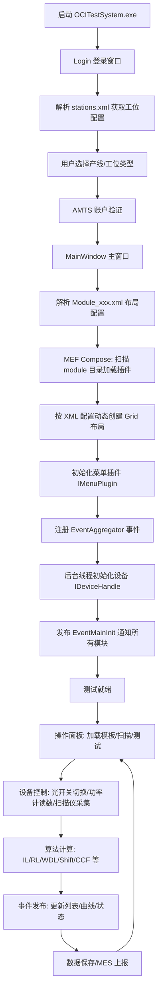
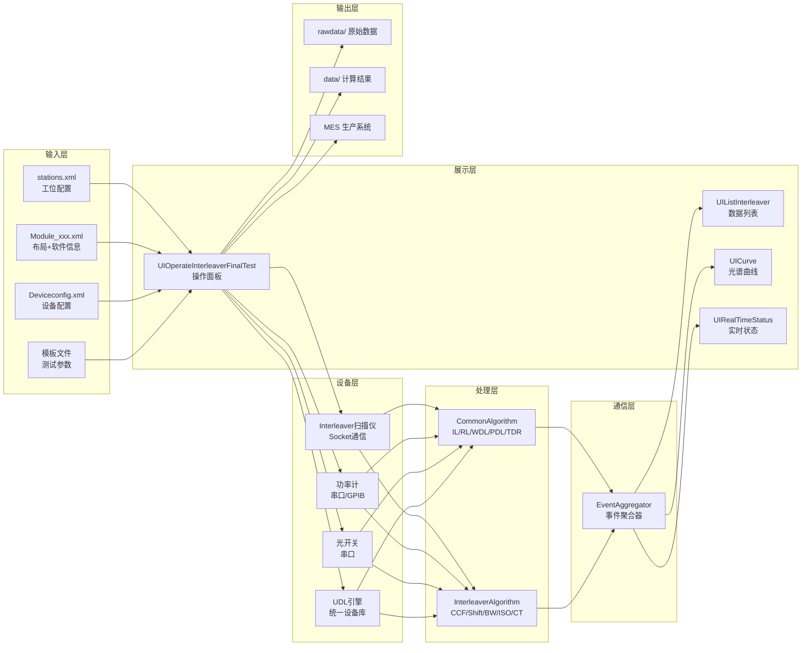

# SW2219_ITL_FTS 系统设计文档

> **OCITS 光器件集成测试系统 — Interleaver(交错器) 终测工站**
> 技术栈：C# / WPF / .NET Framework / MEF 插件架构

---

## 一、概括总结

本项目是 **OCITS（Optical Component Integrated Test System）光器件集成测试系统** 中用于 **Interleaver（光交错器）成品终测** 的工站软件（工站代号 `ITL_FTS`，软件号 `SW1564`）。

系统采用 **MEF（Managed Extensibility Framework）插件式架构**，将主程序壳（OCITestSystem）与各功能模块（操作面板、数据列表、曲线显示、设备控制、算法库等）彻底解耦。主程序在启动时从 `module` 目录动态发现并加载所有插件 DLL，通过 XML 配置文件驱动 UI 布局和设备初始化，模块间通过 **EventAggregator（事件聚合器）** 进行松耦合通信。

### 核心特性

| 特性 | 说明 |
|------|------|
| **插件式架构** | 基于 MEF 的 Import/Export，UI 模块、设备驱动、算法库均可热插拔 |
| **XML 驱动布局** | 主界面 Grid 布局通过 XML 配置文件定义，无需重编译即可调整 |
| **事件总线通信** | 观察者模式的 EventAggregator，实现模块间解耦通信 |
| **多设备抽象** | 统一设备接口层（IPowermeter、IOpticalSwitch 等），支持多厂商设备 |
| **UDL 集成** | 同时支持直接串口控制和 UDL（Unified Device Library）两种设备控制模式 |
| **MES 集成** | 内置 MES 系统对接，支持生产数据上报 |
| **多模式登录** | 支持生产模式(MFG)、研发模式(RD)、调试模式(DEBUG) |

---

## 二、核心业务流



### 业务流程详述

1. **启动与登录**：App.xaml.cs 解析命令行参数(MIMS XML格式)，显示 Login 窗口，用户选择产线和工位类型，通过 AMTS WebService 验证账户
2. **主窗口初始化**：根据工位类型加载对应 `Module_xxx.xml`，MEF 容器扫描 `module` 目录，按 XML 中的 Grid 定义动态布局 UI 模块
3. **设备初始化**：解析 `Deviceconfig.xml`，按配置实例化各设备驱动（功率计、光开关、扫描仪等），可选启用 UDL 引擎
4. **测试执行**：操作面板(UIOperateInterleaverFinalTest)驱动扫描仪采集光谱数据，通过算法库计算各项参数，结果通过事件总线推送给列表和曲线模块显示
5. **数据管理**：测试结果保存至本地文件(temple/rawdata/data 目录)，通过 MES 接口上报生产系统

---

## 三、核心数据流



### 关键数据模型

| 模型 | 用途 |
|------|------|
| `MainInitInfo` | 全局初始化信息：产线、工位、用户、登录模式、MES模式等 |
| `PanelConfige` | UI面板布局：行列位置、跨度、模块名称 |
| `StationShowConfig` | 工位配置：产线→工位类型列表 |
| `DeviceConfig` | 设备配置：设备类型、通信参数 |
| `FusionControl` | 测试模板：测试项、规格参数 |
| `CurveUpdateDetail` | 曲线更新数据包 |
| `ItemContent` | 列表行更新数据包 |

---

## 四、文件夹介绍

| 文件夹 | 说明 |
|--------|------|
| `project/` | 可执行应用程序工程（主程序壳 + 自动更新工具） |
| `library/` | 所有库工程（35个子目录），包含设备驱动、算法、UI模块、通信协议等 |
| `bin/` | 编译输出和运行时部署目录，包含配置文件、模板、原始数据等 |
| `doc/` | 文档目录 |

### `project/` 子目录

| 子目录 | 说明 |
|--------|------|
| `OCITestSystem/` | **主程序壳**工程（WPF），包含 Login、MainWindow、布局解析 |
| `OCITSAutoUpdate/` | **自动更新工具**工程，从服务器下载最新版本并创建桌面快捷方式 |

### `library/` 子目录（按功能分组）

#### 基础设施层

| 子目录 | 说明 |
|--------|------|
| `MolexUtility/` | **核心公共库**（C#），定义所有设备接口、算法接口、协议模型、通用函数、MES对接、串口控制等 |
| `MoUtilityLib/` | **辅助工具库**（WinForm），包含登录窗口、模板数据处理、曲线图表、功率计控制等 |
| `ProtocolAggregator/` | **事件聚合器**，实现模块间松耦合通信的观察者模式 |
| `MenuPluginInterface/` | **菜单插件接口**，定义 `IMenuPlugin` 供功能模块注册为菜单项 |
| `commondll/` | 公共 DLL 存放目录（当前为空） |

#### 设备控制层

| 子目录 | 说明 |
|--------|------|
| `DeviceControl/` | **设备管理器**，实现 `IDeviceHandle`，统一管理功率计、光开关、扫描仪、UDL等全部设备的生命周期 |
| `ConfigModel/` | **设备配置插件**，提供设备配置 UI（菜单插件形式），解析/编辑 `Deviceconfig.xml` |

#### 算法层

| 子目录 | 说明 |
|--------|------|
| `CommonAlgorithm/` | **通用算法库**：IL、RL、WDL、TDL、WDR、TDR、PDL、Res 等光学参数计算 |
| `InterleaverAlgorithm/` | **Interleaver 专用算法库**（2500+行）：CCF、Shift、BW、MaxIL、ISO、CT、GD、PMD、CD 等交错器特有参数 |

#### UI 模块层 — 操作面板

| 子目录 | 说明 |
|--------|------|
| `UIOperateInterleaver/` | Interleaver 调节操作面板 |
| `UIOperateInterleaverFinalTest/` | **Interleaver 终测操作面板**（主业务模块，176KB 代码） |
| `UIOperateInterleaverMaterialTest/` | Interleaver 来料测试操作面板 |
| `UIOperateITLCD/` | Interleaver CD 测试操作面板 |
| `UIOperateCIR/` | CIR（环行器）操作面板 |
| `UIOperate1X8/` | 1×8 分光器操作面板 |
| `UIOperateLLCCAdjust/` | LLCC 调节操作面板 |
| `UIDemuxAdjust/` | Demux 调节操作面板 |
| `UIDemuxTest/` | Demux 测试操作面板 |

#### UI 模块层 — 数据列表

| 子目录 | 说明 |
|--------|------|
| `UIListCommon/` | 通用列表基础模块 |
| `UIListInterleaver/` | Interleaver 专用数据列表 |
| `UIListMultiParam/` | 多参数列表显示 |
| `UIListSingleParam/` | 单参数列表显示 |
| `UIListDemuxAdjust/` | Demux 调节列表 |
| `UIListDemuxTest/` | Demux 测试列表 |

#### UI 模块层 — 辅助显示

| 子目录 | 说明 |
|--------|------|
| `UICurve/` | **光谱曲线显示控件** |
| `RealtimePower/` | **实时功率显示控件** |
| `UIRealTimeStatus/` | **实时状态显示控件** |
| `TestDetailShow/` | 测试详情显示（PD/1×8） |

#### 测试 DLL 层

| 子目录 | 说明 |
|--------|------|
| `InterleaverTestdll/` | Interleaver 扫描客户端 DLL（Socket 通信） |
| `InterleaverTestdll-bk/` | 备份版本 |
| `LibTest/` | 库测试工程 |
| `TestMolexUtility/` | MolexUtility 测试工程 |

### `bin/` 运行时目录结构

```
bin/
├── ITL_FTS/                    # 终测工站部署目录
│   ├── OCITestSystem.exe       # 主程序
│   ├── MolexUtility.dll        # 核心库
│   ├── ProtocolAggregator.dll  # 事件总线
│   ├── module/                 # MEF 插件目录
│   │   ├── module_ITL_FTS.xml  # UI 布局配置
│   │   ├── DeviceControl.dll   # 设备控制插件
│   │   ├── UIOperateInterleaverFinalTest.dll
│   │   ├── UIListInterleaver.dll
│   │   ├── UICurve.dll
│   │   └── ...其他插件 DLL
│   ├── set/                    # 配置文件目录
│   │   ├── stations.xml        # 工位配置
│   │   ├── AllDevice.xml       # 设备清单
│   │   ├── UDLConfig.xml       # UDL 设备配置
│   │   └── ...其他配置
│   ├── temple/                 # 测试模板
│   ├── reference/              # 归零参考数据
│   ├── rawdata/                # 原始测试数据
│   └── data/                   # 计算结果数据
├── Debug/                      # 调试构建输出
├── Release/                    # 发布构建输出
└── SwitchConfig/               # 光开关配置
```

---

## 五、核心工程介绍

### 5.1 OCITestSystem（主程序壳）

- **类型**：WPF Application（.NET Framework, Visual Studio 2015）
- **职责**：应用程序入口，负责登录验证、MEF 容器初始化、动态 UI 布局、设备初始化调度
- **依赖**：MolexUtility, ProtocolAggregator, MenuPluginInterface
- **核心文件**：App.xaml.cs, Login.xaml.cs, MainWindow.xaml.cs, LayoutXMLParse.cs, StationXMLParser.cs

### 5.2 OCITSAutoUpdate（自动更新工具）

- **类型**：WPF Application
- **职责**：从远程服务器检查并下载软件更新，创建桌面快捷方式
- **核心文件**：Login.xaml.cs (含更新逻辑), Common.cs, ShortCutCreator.cs

### 5.3 MolexUtility（核心公共库）

- **类型**：Class Library
- **职责**：定义全系统的接口契约和公共基础设施
- **关键子模块**：
  - `Device/` — 所有设备接口定义
  - `Algorithm/` — 算法接口定义
  - `Protocol/` — 通信协议数据模型
  - `UIList/` — 列表 UI 数据模型
  - `SerialControl/` — 串口通信封装
  - `FusionControl.cs` — 测试模板数据管理（122KB）
  - `MESControl.cs` — MES 系统对接（72KB）
  - `CommonFunction.cs` — 通用工具函数

### 5.4 DeviceControl（设备管理器）

- **类型**：Class Library（MEF Export）
- **职责**：设备生命周期管理，按 XML 配置自动初始化各类设备
- **支持设备**：功率计(1830/JH/Oplink)、光开关(Mini1X8/Pbox/OMS)、光源(8164/SourceBank)、Interleaver扫描仪、PDL控制器、CD扫描、FSTP扫描、UDL设备(Switch/TCC/FSTP)
- **核心文件**：DeviceHandle.cs (735行)

### 5.5 ProtocolAggregator（事件聚合器）

- **类型**：Class Library（MEF Export, Shared）
- **职责**：模块间通信的中枢，基于观察者模式的发布-订阅系统
- **核心事件**：EventCurveUpdate, EventListItemUpdate, EventTemplateUpdate, EventMainInit, EventXml, EventRealTimeStatus, EventRealtimePowerUpdate, EventListSelectChanged, EventListKeyDown

### 5.6 InterleaverAlgorithm（交错器算法库）

- **类型**：Class Library（MEF Export, NonShared）
- **职责**：Interleaver 专有的光学参数计算（2541行算法代码）
- **核心算法**：CCF(中心频率), Shift(频率漂移), BW(带宽), MaxIL(最大插损), ISO(隔离度), CT(串扰), GD(群延迟), PMD(偏振模色散), CD(色散), FSR(自由光谱范围)

### 5.7 UIOperateInterleaverFinalTest（终测操作面板）

- **类型**：WPF UserControl（MEF Export）
- **职责**：Interleaver 终测的主业务模块，包含扫描控制、参数计算、结果判定、数据保存
- **核心文件**：OperateInterleaver.xaml.cs (176KB，系统最大单文件)

---

## 六、核心类介绍

### 6.1 架构核心类

#### `MainWindow`（主窗口）
- **位置**：`project/OCITestSystem/OCITestSystem/MainWindow.xaml.cs`
- **职责**：MEF 容器宿主，动态 UI 布局引擎
- **关键成员**：
  - `[ImportMany] IEnumerable<UserControl> cards` — 导入所有 UI 模块
  - `[Import] IEventAggregator EventAggregator` — 事件聚合器
  - `[ImportMany] IEnumerable<IMenuPlugin> menuPlugins` — 菜单插件集
  - `[Import] IDeviceHandle deviceHandle` — 设备管理器
- **关键方法**：`Compose()` 扫描 module 目录初始化 MEF 容器；`Window_Loaded()` 解析 XML 创建动态布局

#### `EventAggregator`（事件聚合器）
- **位置**：`library/ProtocolAggregator/EventAggregator.cs`
- **模式**：观察者模式 + MEF 单例（CreationPolicy.Shared）
- **核心方法**：`T GetEvent<T>()` — 获取指定类型的事件实例

#### `CompositePresentationEvent<T>`（泛型事件基类）
- **位置**：`library/ProtocolAggregator/EventBase.cs`
- **核心方法**：`Subscribe(Action<T>)` 订阅事件；`Publish(T)` 发布事件

#### `LayoutXMLParser`（布局解析器）
- **位置**：`project/OCITestSystem/OCITestSystem/LayoutXMLParse.cs`
- **职责**：解析 Module_xxx.xml，提取行列定义、模块布局、软件版本信息

### 6.2 设备接口层

#### `IDeviceHandle`（设备管理接口）
- **位置**：`library/MolexUtility/MolexUtility/Device/IDeviceHandle.cs`
- **核心方法**：
  - `InitDeviceByConfig()` — 按配置初始化所有设备
  - `CloseAllDevice()` — 关闭所有设备
  - `GetPowermeterByIndex()` — 获取功率计
  - `GetSwitchByType()` — 获取光开关
  - `GetInterleaverScanByFlag()` — 获取 Interleaver 扫描仪
  - `GetUDLFstpByGUID()` / `GetUDLSwitchByGUID()` / `GetUDLTCCByGUID()` — UDL 设备获取

#### `DeviceHandle`（设备管理实现）
- **位置**：`library/DeviceControl/DeviceControl/DeviceHandle.cs`
- **职责**：维护所有设备实例列表，按 XML 配置工厂化创建设备对象
- **设备集合**：`List<IPowermeter>`, `List<IOpticalSwitch>`, `List<IInterleaverScan>`, `List<IFSTPScan>`, `List<IUDLFSTP>` 等

#### `Devices`（设备类型枚举）
- **位置**：`library/MolexUtility/MolexUtility/Device/Devices.cs`
- **定义**：Pwm1830, PwmJH, Oplink1830, Hp8164, SourceBank, Interleaver, Mini1X8Switch, PboxSwitch, OMSSwitch, Automation, PDLController, CDScan, NEWFSTPScan, UDLSwitch, UDLTCC, UDLFSTP

#### 设备接口族
| 接口 | 位置 | 说明 |
|------|------|------|
| `IPowermeter` | Device/IPowermeter.cs | 功率计：读功率、设波长、归零 |
| `IOpticalSwitch` | Device/IOpticalSwitch.cs | 光开关：切换通道 |
| `IOpticalSource` | Device/IOpticalSource.cs | 光源：开关、设波长/功率 |
| `IInterleaverScan` | Device/IInterleaverScan.cs | Interleaver 扫描仪 |
| `IFSTPScan` | Device/IFSTPScan.cs | FSTP 扫描仪 |
| `ICurrent` | Device/ICurrent.cs | 电流计/万用表 |
| `IPDLController` | Device/IPDLController.cs | 偏振控制器 |
| `IAutomation` | Device/IAutomation.cs | 自动化接口 |
| `IUDLFSTP` | Device/IUDLFSTP.cs | UDL FSTP 设备 |
| `IUDLSwitch` | Device/IUDLSwitch.cs | UDL 光开关 |
| `IUDLTCC` | Device/IUDLTCC.cs | UDL TCC 设备 |

### 6.3 算法层

#### `IAlgotithm`（通用算法接口）
- **位置**：`library/MolexUtility/MolexUtility/Algorithm/IAlgotithm.cs`
- **方法**：MaxIL, RL, WDL, TDL, WDR, WDRM, TDR, TDRM, Res, PDL

#### `Algorithm`（通用算法实现）
- **位置**：`library/CommonAlgorithm/Algorithm.cs`
- **实现**：基于 `CommonFunction.GetMaxMin()` 等工具方法计算各光学参数

#### `IInterleaverAlgorithm`（交错器算法接口）
- **位置**：`library/MolexUtility/MolexUtility/Algorithm/IInterleaverAlgorithm.cs`
- **方法**：CCF, Shift, MaxIL, BW, ISO, CT, GD, PMD, CD, FSR 等

#### `InterleaverAlgorithm`（交错器算法实现）
- **位置**：`library/InterleaverAlgorithm/InterleaverAlgorithm.cs`
- **核心逻辑**：
  - `FindPassbandIndex()` — 根据 ITU 中心频率和有效带宽定位数据范围
  - `FindDbDownIndex/Fre()` — 找 dB down 左右边界（用于计算带宽）
  - `CCF()` — 计算实际中心频率（dB down 左右频率的中点）
  - `Shift()` — 计算频率漂移（实际中心频率 - 标称 ITU）

### 6.4 数据模型层

#### `MainInitInfo`（全局初始化信息）
- **位置**：`library/MolexUtility/MolexUtility/Protocol/MainInitInfo.cs`
- **字段**：ProductLine, StationType, StationID, UserID, LoginMode, MESMode, TemplateType, TestProcess, Goldsample, AutomationType, DeviceInitRes

#### `PanelConfige`（面板布局配置）
- **位置**：`project/OCITestSystem/OCITestSystem/PanelConfige.cs`
- **字段**：Row, Column, RowSpan, ColumnSpan, ModuleName, Name, ModuleIndex

#### `IMenuPlugin`（菜单插件接口）
- **位置**：`library/MenuPluginInterface/IMenuPlugin.cs`
- **成员**：`MenuDetail MenuHeader`（菜单层级）；`Show(MainInitInfo)` 显示插件窗口

#### `FusionControl`（测试模板控制）
- **位置**：`library/MolexUtility/MolexUtility/FusionControl.cs`（122KB）
- **职责**：管理测试模板数据、规格参数、Pass/Fail 判定逻辑

### 6.5 通信与工具类

#### `CommonFunction`（通用工具函数）
- **位置**：`library/MolexUtility/MolexUtility/CommonFunction.cs`
- **功能**：日志记录、最大最小值计算、默认值管理、WebService 调用、用户数据获取

#### `MESControl`（MES 对接控制）
- **位置**：`library/MolexUtility/MolexUtility/MESControl.cs`（72KB）
- **职责**：测试数据上报、MES 模板管理

#### `ISerial` / `SerialDotNet` / `SerialNI`（串口通信）
- **位置**：`library/MolexUtility/MolexUtility/SerialControl/`
- **职责**：封装 .NET 原生串口和 NI 串口两种实现

---

## 七、关键设计模式总结

| 模式 | 应用位置 | 说明 |
|------|----------|------|
| **MEF 插件** | MainWindow ↔ 所有模块 | Import/Export 实现模块的自动发现与注入 |
| **观察者模式** | EventAggregator | Publish/Subscribe 实现模块间解耦通信 |
| **工厂模式** | DeviceHandle | 根据设备类型字符串创建对应驱动实例 |
| **策略模式** | IAlgotithm / IInterleaverAlgorithm | 算法接口可替换不同实现 |
| **单例模式** | EventAggregator (Shared), ConfigPlugin | MEF CreationPolicy 控制实例策略 |
| **XML 配置驱动** | 布局/设备/工位 | 通过 XML 文件控制运行时行为 |

---

> 文档生成日期：2026-05-06
