# 工程关联关系文档

> 基于 `library/工程功能说明.xlsx` 审核，并补充完善工程依赖与关联关系

---

## 一、Excel 工程说明审核

### 原始 Excel 内容

| 工程名称 | 功能说明 | 导入名称 | 界面配置名称 |
|----------|----------|----------|-------------|
| ConfigModel | 设备配置模块 | IMenuPlugin | |
| DeviceControl | 设备控制、处理模块，各种设备操作都在此工程中 | IDeviceHandle | |
| MenuPluginInterface | 菜单插件接口 | 直接引用 | |
| MolexUtility | 公共功能、接口等都放在这个动态库中 | 直接引用 | |
| ProtocolAggregator | 模块间通信方式。采用MEF、事件、观察者模式来实现 | 直接引用 | |
| UICurve | 曲线显示模块 | UserControl | UICurve |
| UIListCommon | 测试项列表显示基础模块 | UserControl | UIListCommon |
| UIListMultiParam | 基于UIListCommon，可显示多个产品测试信息，每行显示多个参数项 | UserControl | UIListMultiParam |
| UIListSingleParam | 基于UIListCommon，可显示多个产品测试信息，每行显示单个参数项 | UserControl | UIListSingleParam |
| UIListInterleaver | Interleaver列表显示处理模块 | UserControl | UIListInterleaver |
| UIOperate1X8 | PD1X8逻辑操作测试模块 | UserControl | UIOperate1X8 |
| UIOperateInterleaver | Interleaver调试测试逻辑控制模块 | UserControl | UIOperateInterleaver |
| UIRealTimeStatus | 测试过程实时状态列表显示模块 | UserControl | UIRealTimeStatus |
| RealtimePower | 功率计实时显示模块 | UserControl | RealtimePower |
| CommonAlgorithm | 公共算法模块 | IAlgotithm | |
| InterleaverAlgorithm | Interleaver算法模块 | IInterleaverAlgorithm | |

### 审核结论

#### ✅ 正确的部分
- 16 个工程的**功能说明**基本准确
- **导入名称**分类正确：`IMenuPlugin` / `IDeviceHandle` / `UserControl` / `IAlgotithm` / `IInterleaverAlgorithm` / 直接引用
- **界面配置名称**与 `module_xxx.xml` 中的 `Module` 属性一致

#### ⚠️ 需要补充的工程（Excel 中缺失）

| 工程名称 | 功能说明 | 导入名称 | 界面配置名称 | 备注 |
|----------|----------|----------|-------------|------|
| **OCITestSystem** | 主程序壳，MEF 宿主，动态布局引擎 | - (Application) | - | project/ 下的主工程 |
| **OCITSAutoUpdate** | 自动更新工具 | - (Application) | - | project/ 下的工具 |
| **InterleaverTestdll** | Interleaver 扫描仪 Socket 通信客户端 | 直接引用 | - | 又名 FastScanClentDLL |
| **UIOperateInterleaverFinalTest** | Interleaver 终测操作面板（主业务） | UserControl | UIOperateInterleaverFinalTest | 当前工站核心模块 |
| **UIOperateInterleaverMaterialTest** | Interleaver 来料测试操作面板 | UserControl | UIOperateInterleaverMaterialTest | |
| **UIOperateITLCD** | Interleaver CD 测试操作面板 | UserControl | UIOperateITLCD | |
| **UIOperatCIR** | 环行器(CIR)操作面板 | UserControl | UIOperatCIR | |
| **UIOperateLLCCAdjust** | LLCC 调节操作面板 | UserControl | UIOperateLLCCAdjust | |
| **UIDemuxAdjust** | Demux 调节操作面板 | UserControl | UIDemuxAdjust | |
| **UIDemuxTest** | Demux 测试操作面板 | UserControl | UIDemuxTest | |
| **UIListDemuxAdjust** | Demux 调节列表 | UserControl | UIListDemuxAdjust | |
| **UIListDemuxTest** | Demux 测试列表 | UserControl | UIListDemuxTest | |
| **TestDetailShow** | 测试详情显示（PD/1×8） | UserControl | TestDetailShow | |
| **MoUtilityLib** | 辅助工具库（WinForm） | 直接引用 | - | 含登录、图表等 |
| **TestMolexUtility** | MolexUtility 单元测试 | - (Test) | - | |
| **LibTest** | 库测试工程 | - (Test) | - | |

> **结论**：Excel 仅列出了 16 个工程，实际有效工程约 **32 个**。缺少了所有 FinalTest/MaterialTest/CD 操作面板、Demux 系列、CIR、LLCC、测试工程和两个可执行程序。

---

## 二、工程分层架构

```
┌──────────────────────────────────────────────────────────────────────┐
│                        APPLICATION 层                                │
│  ┌─────────────────┐  ┌─────────────────┐                           │
│  │ OCITestSystem    │  │ OCITSAutoUpdate  │                          │
│  │ (主程序壳/MEF宿主)│  │ (自动更新工具)   │                          │
│  └────────┬────────┘  └────────┬────────┘                           │
├───────────┼────────────────────┼─────────────────────────────────────┤
│           │       PLUGIN 模块层 (MEF 动态加载)                       │
│   ┌───────┴──────────────────────────────────────────────────┐      │
│   │  UI 操作面板 (Export UserControl)                         │      │
│   │  ┌────────────────────────────┐ ┌─────────────────────┐  │      │
│   │  │UIOperateInterleaverFinal..│ │UIOperateInterleaver  │  │      │
│   │  │UIOperateInterleaverMat... │ │UIOperateITLCD        │  │      │
│   │  │UIOperate1X8               │ │UIOperatCIR           │  │      │
│   │  │UIOperateLLCCAdjust        │ │UIDemuxAdjust/Test    │  │      │
│   │  └────────────────────────────┘ └─────────────────────┘  │      │
│   │  UI 数据展示 (Export UserControl)                         │      │
│   │  ┌────────────────────┐ ┌──────────────────────────────┐ │      │
│   │  │UICurve (曲线)       │ │UIListInterleaver            │ │      │
│   │  │UIRealTimeStatus    │ │UIListMultiParam/SingleParam  │ │      │
│   │  │RealtimePower       │ │UIListDemuxAdjust/Test        │ │      │
│   │  │TestDetailShow      │ │                              │ │      │
│   │  └────────────────────┘ └──────────────────────────────┘ │      │
│   │  功能插件 (Export IMenuPlugin / IDeviceHandle / IAlgorithm)│      │
│   │  ┌─────────────────┐ ┌─────────────────┐ ┌────────────┐ │      │
│   │  │ConfigModel      │ │DeviceControl    │ │CommonAlg.. │ │      │
│   │  │(设备配置菜单)     │ │(设备管理器)      │ │Interleav.. │ │      │
│   │  └─────────────────┘ └─────────────────┘ └────────────┘ │      │
│   └──────────────────────────────────────────────────────────┘      │
├──────────────────────────────────────────────────────────────────────┤
│                      INFRASTRUCTURE 基础设施层                       │
│  ┌──────────────────────┐ ┌──────────────────┐ ┌────────────────┐   │
│  │ MolexUtility         │ │ProtocolAggregator│ │MenuPlugin      │   │
│  │ (接口/模型/工具/串口) │ │(事件聚合器)       │ │Interface       │   │
│  └──────────────────────┘ └──────────────────┘ └────────────────┘   │
│  ┌──────────────────────┐ ┌──────────────────┐                      │
│  │ InterleaverTestdll   │ │ UIListCommon     │  ← 列表基类          │
│  │ (扫描仪Socket客户端)  │ │ (列表公共基础)    │                      │
│  └──────────────────────┘ └──────────────────┘                      │
├──────────────────────────────────────────────────────────────────────┤
│                      EXTERNAL 外部依赖层                             │
│  USL.SYS.dll  USL.TAS.dll  USL.TAS.C.dll  (UDL 引擎)               │
│  MIMS.BLL.dll  MIMS.DBUtility.dll  (MES 系统)                       │
│  MySql.Data.dll  Newtonsoft.Json.dll  CRC32Lib.dll                  │
└──────────────────────────────────────────────────────────────────────┘
```

---

## 三、工程依赖关系图（基于 .csproj 实际分析）

```mermaid
graph TD
    subgraph "APPLICATION 层"
        OCITS["OCITestSystem<br/>(主程序壳)"]
        AUTO["OCITSAutoUpdate<br/>(自动更新)"]
    end

    subgraph "INFRASTRUCTURE 基础设施层"
        MU["MolexUtility<br/>(公共库/接口定义)"]
        PA["ProtocolAggregator<br/>(事件聚合器)"]
        MPI["MenuPluginInterface<br/>(菜单插件接口)"]
        ULC["UIListCommon<br/>(列表基类)"]
        ITD["InterleaverTestdll<br/>(扫描仪客户端)"]
    end

    subgraph "PLUGIN 模块层 — 操作面板"
        UOIFT["UIOperateInterleaverFinalTest<br/>(终测操作)"]
        UOI["UIOperateInterleaver<br/>(调试操作)"]
        UOIMT["UIOperateInterleaverMaterialTest<br/>(来料测试)"]
        UOCD["UIOperateITLCD<br/>(CD测试)"]
        UO1X8["UIOperate1X8<br/>(PD1X8操作)"]
        UOCIR["UIOperatCIR<br/>(CIR操作)"]
        UOLLCC["UIOperateLLCCAdjust<br/>(LLCC调节)"]
        UIDA["UIDemuxAdjust<br/>(Demux调节)"]
        UIDT["UIDemuxTest<br/>(Demux测试)"]
    end

    subgraph "PLUGIN 模块层 — 数据展示"
        UC["UICurve<br/>(曲线显示)"]
        UILI["UIListInterleaver"]
        UILMP["UIListMultiParam"]
        UILSP["UIListSingleParam"]
        UILTA["UIListDemuxAdjust"]
        UILTT["UIListDemuxTest"]
        URST["UIRealTimeStatus<br/>(实时状态)"]
        RP["RealtimePower<br/>(实时功率)"]
        TDS["TestDetailShow<br/>(测试详情)"]
    end

    subgraph "PLUGIN 模块层 — 功能插件"
        CM["ConfigModel<br/>(设备配置)"]
        DC["DeviceControl<br/>(设备管理)"]
        CA["CommonAlgorithm<br/>(通用算法)"]
        IA["InterleaverAlgorithm<br/>(ITL算法)"]
    end

    %% APPLICATION 层依赖
    OCITS --> MU & PA & MPI

    %% 基础设施层依赖
    PA --> MU
    MPI --> MU
    ULC --> MU & PA

    %% 操作面板依赖
    UOIFT --> MU & PA & MPI
    UOI --> MU & PA
    UOIMT --> MU & PA
    UOCD --> MU & PA
    UO1X8 --> MU & PA
    UOCIR --> MU & PA
    UOLLCC --> MU & PA
    UIDA --> MU & PA
    UIDT --> MU & PA

    %% 数据展示依赖
    UC --> MU & PA
    URST --> MU & PA
    RP --> MU & PA
    TDS --> MU & PA
    UILI --> MU & PA & ULC
    UILMP --> MU & PA & ULC
    UILSP --> MU & PA & ULC
    UILTA --> MU & PA & ULC
    UILTT --> MU & PA & ULC

    %% 功能插件依赖
    CM --> MU & PA & MPI
    DC --> MU
    CA --> MU
    IA --> MU

    %% 样式
    style MU fill:#e74c3c,color:#fff
    style PA fill:#3498db,color:#fff
    style MPI fill:#2ecc71,color:#fff
    style OCITS fill:#9b59b6,color:#fff
    style ULC fill:#f39c12,color:#fff
```



---

## 四、依赖关系详细矩阵

### 图例
- **M** = MolexUtility
- **P** = ProtocolAggregator
- **I** = MenuPluginInterface
- **L** = UIListCommon
- **MEF** = System.ComponentModel.Composition

| 工程 | M | P | I | L | MEF | 导出类型 | XML配置名 |
|------|:-:|:-:|:-:|:-:|:---:|----------|-----------|
| **OCITestSystem** | ✅ | ✅ | ✅ | | ✅ | Application (MEF宿主) | - |
| **MolexUtility** | - | | | | | 直接引用 (最底层) | - |
| **ProtocolAggregator** | ✅ | - | | | ✅ | IEventAggregator (Shared) | - |
| **MenuPluginInterface** | ✅ | | - | | | 直接引用 | - |
| **UIListCommon** | ✅ | ✅ | | - | ✅ | UserControl | UIListCommon |
| **ConfigModel** | ✅ | ✅ | ✅ | | ✅ | IMenuPlugin | - |
| **DeviceControl** | ✅ | | | | ✅ | IDeviceHandle | - |
| **CommonAlgorithm** | ✅ | | | | ✅ | IAlgotithm | - |
| **InterleaverAlgorithm** | ✅ | | | | ✅ | IInterleaverAlgorithm | - |
| **UIOperateInterleaverFinalTest** | ✅ | ✅ | ✅ | | ✅ | UserControl | UIOperateInterleaverFinalTest |
| **UIOperateInterleaver** | ✅ | ✅ | | | ✅ | UserControl | UIOperateInterleaver |
| **UIOperateInterleaverMaterialTest** | ✅ | ✅ | | | ✅ | UserControl | UIOperateInterleaverMaterialTest |
| **UIOperateITLCD** | ✅ | ✅ | | | ✅ | UserControl | UIOperateITLCD |
| **UIOperate1X8** | ✅ | ✅ | | | ✅ | UserControl | UIOperate1X8 |
| **UIOperatCIR** | ✅ | ✅ | | | ✅ | UserControl | UIOperatCIR |
| **UIOperateLLCCAdjust** | ✅ | ✅ | | | ✅ | UserControl | UIOperateLLCCAdjust |
| **UIDemuxAdjust** | ✅ | ✅ | | | ✅ | UserControl | UIDemuxAdjust |
| **UIDemuxTest** | ✅ | ✅ | | | ✅ | UserControl | UIDemuxTest |
| **UICurve** | ✅ | ✅ | | | ✅ | UserControl | UICurve |
| **UIListInterleaver** | ✅ | ✅ | | ✅ | ✅ | UserControl | UIListInterleaver |
| **UIListMultiParam** | ✅ | ✅ | | ✅ | ✅ | UserControl | UIListMultiParam |
| **UIListSingleParam** | ✅ | ✅ | | ✅ | ✅ | UserControl | UIListSingleParam |
| **UIListDemuxAdjust** | ✅ | ✅ | | ✅ | ✅ | UserControl | UIListDemuxAdjust |
| **UIListDemuxTest** | ✅ | ✅ | | ✅ | ✅ | UserControl | UIListDemuxTest |
| **UIRealTimeStatus** | ✅ | ✅ | | | ✅ | UserControl | UIRealTimeStatus |
| **RealtimePower** | ✅ | ✅ | | | ✅ | UserControl | RealtimePower |
| **TestDetailShow** | ✅ | ✅ | | | ✅ | UserControl | TestDetailShow |

---

## 五、MEF 加载机制与运行时关联

### 加载流程
```
OCITestSystem.exe 启动
  │
  ├─ 直接引用(编译时绑定)
  │   ├── MolexUtility.dll         ← bin/ 根目录
  │   ├── ProtocolAggregator.dll   ← bin/ 根目录
  │   └── MenuPluginInterface.dll  ← bin/ 根目录
  │
  └─ MEF 动态发现(运行时绑定) ← 扫描 module/ 目录
      ├── [Import]  IEventAggregator  ← ProtocolAggregator (Shared单例)
      ├── [Import]  IDeviceHandle     ← DeviceControl.dll
      ├── [ImportMany] UserControl[]  ← 所有 UI 模块 DLL
      ├── [ImportMany] IMenuPlugin[]  ← ConfigModel.dll
      ├── [ImportMany] IAlgotithm[]   ← CommonAlgorithm.dll (仅标记,MEF管理)
      └── [ImportMany] IInterleaverAlgorithm[] ← InterleaverAlgorithm.dll
```

### module_xxx.xml 中的模块配置（以 ITL_FTS 为例）

```xml
<!-- UI 布局模块 -->
<DockPanel Module="UIOperateInterleaverFinalTest" />  ← 操作面板
<DockPanel Module="UICurve" Index="0" Name="EntireArea" />  ← 曲线显示
<DockPanel Module="UIRealTimeStatus" />  ← 实时状态
<DockPanel Module="UIListInterleaver" />  ← 数据列表

<!-- 功能模块（不显示UI，仅加载功能） -->
<Function Module="ConfigModel" />         ← 设备配置菜单
<Function Module="DeviceControl" />       ← 设备管理器
<Function Module="FastScanClentDLL" />    ← 扫描仪客户端
<Function Module="InterleaverAlgorithm" /> ← 算法库
```

---

## 六、工程通信关联（EventAggregator 事件）

模块之间不直接引用，而是通过 EventAggregator 发布/订阅事件通信：

```
操作面板 (UIOperateXxx)
  │
  ├── Publish(EventCurveUpdate)         ──→ UICurve（更新曲线）
  ├── Publish(EventListItemUpdate)      ──→ UIListXxx（更新列表行）
  ├── Publish(EventTemplateUpdate)      ──→ UIListXxx（更新模板）
  ├── Publish(EventRealTimeStatus)      ──→ UIRealTimeStatus（更新状态）
  ├── Publish(EventRealtimePowerUpdate) ──→ RealtimePower（更新功率）
  │
  └── Subscribe(EventListSelectChanged) ←── UIListXxx（列表选中变化）
      Subscribe(EventListKeyDown)       ←── UIListXxx（列表键盘事件）

MainWindow
  └── Publish(EventMainInit)            ──→ 所有模块（初始化完成通知）
      Publish(EventXml)                 ──→ 所有模块（XML 配置推送）
```

---

## 七、依赖层级规则总结

| 规则 | 说明 |
|------|------|
| **单向依赖** | 上层依赖下层，禁止反向引用 |
| **MolexUtility 是根** | 所有工程都直接或间接依赖它 |
| **ProtocolAggregator 依赖 MolexUtility** | 因为事件负载类型定义在 MolexUtility 中 |
| **UI模块 均依赖 MU + PA** | UI模块需要接口定义(MU)和事件通信(PA) |
| **UIList子类 额外依赖 UIListCommon** | 列表继承体系 |
| **功能插件 仅依赖 MU** | DeviceControl/CommonAlgorithm/InterleaverAlgorithm 不需要 PA |
| **模块间零引用** | UI模块之间不直接引用，通过事件解耦 |
| **MEF 隔离** | 主程序不引用任何插件DLL，运行时通过 module/ 目录发现 |

---

> 文档生成日期：2026-05-06
