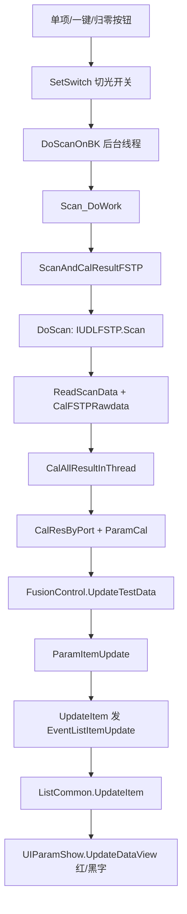

终测这条链路是 **主业务插件 + 下方列表插件 + 事件总线** 分工的，不是全在一个 XAML 里。按「切开关 → 采数 → 算参 → 刷表 → 超限标红」说明如下。

---

## 1. 模块分工（先看哪里）

| 区域                                            | 工程/文件                                                    | 作用                                         |
| ----------------------------------------------- | ------------------------------------------------------------ | -------------------------------------------- |
| 左侧操作区（SN、打开模板、归零、单项/一键测试） | [`OperateInteleaverFinalTest.xaml.cs`](library/UIOperateInterleaverFinalTest/UIOperateInterleaverFinalTest/OperateInteleaverFinalTest.xaml.cs) | **主业务**：开关、扫描、算法、发事件更新列表 |
| 下方参数表格                                    | [`UIListInterleaver/ListInterleaver.cs`](library/UIListInterleaver/ListInterleaver.cs) → 基类 [`UIListCommon/ListCommon.xaml.cs`](library/UIListCommon/ListCommon.xaml.cs) | **显示**：WinForms `DataGridView`            |
| 表格单元格绘制（含红色）                        | [`MolexUtility/UIList/UIParamShow.cs`](library/MolexUtility/UIList/UIParamShow.cs) | `ForeColor = Red`                            |
| 合格判定                                        | [`MolexUtility/FusionControl.cs`](library/MolexUtility/FusionControl.cs) `CheckPassOrFail` / `UpdateTestData` | 对比 MES 上下限                              |
| 光谱/IL 算法                                    | [`ParamCal.cs`](library/UIOperateInterleaverFinalTest/UIOperateInterleaverFinalTest/ParamCal.cs) + `InterleaverAlgorithm` | 从扫描缓冲算 IL/PDL 等                       |
| 扫描原始数据读写                                | [`InterleaverScanResult.cs`](library/UIOperateInterleaverFinalTest/UIOperateInterleaverFinalTest/InterleaverScanResult.cs) | 读 FSTP 生成的 CSV                           |

布局由 `module\module_ITL_FTS.xml` 把 `UIOperateInterleaverFinalTest` 和 `UIListInterleaver` 拼在主窗体上（列表不在终测 XAML 里）。

---

## 2. 主流程（从按钮到表格）



### 入口（谁触发扫描）

- **系统归零**：`btnScanRef_Click` → `ScanRef()` → `SetSwitch` → `Scan_DoWork`（`RefWithPDL`）
- **一键测试**：`btnOnekeyScan_Click` → `OnekeyScan()` → `SetSwitch` → `DoScanOnBK()`
- **单项测试**：`btnSingleScan_Click` → `SetSwitch` → `DoScanOnBK()`

关键行号（均在 `OperateInteleaverFinalTest.xaml.cs`）：

- 切开关：`SetSwitch` 约 **1530**；调用点约 **1447**（归零）、**2942**（一键）、**3205**（单项）
- 启动扫描线程：`DoScanOnBK` 约 **1998** → `Scan_DoWork` 约 **2018**

---

## 3. 切开关（具体代码）

```1530:1555:library/UIOperateInterleaverFinalTest/UIOperateInterleaverFinalTest/OperateInteleaverFinalTest.xaml.cs
        private void SetSwitch(int productIndex, string portKey)
        {
            int channel = GetSwitchChannelForPort(productIndex, portKey);
            ...
            string flag = productIndex.ToString() + "::" + channel.ToString() + ":" + SWMaxPortFlag.ToString();
            ...
            opticalSwitch.SetSwitch(flag, ref errMsg)
```

通过 `GetSwitchByType` 分别读 `switch\interleaverSwitch-MPLUS-IN`（入光）与 `interleaverSwitch-MPLUS-OUT`（出光）指令表；未配双设备时回退 `interleaverSwitch-MPLUS`。

---

## 4. 「读 Interleaver 的值」——当前终测实际走 FSTP，不是旧 InterleaverScan

`Scan_DoWork` 里 **`isFstpScan = true`（写死）**，因此主路径是：

1. **`DoScan`**（约 **1902**）：`DeviceControl.GetUDLFstpByGUID(2)` → `IUDLFSTP.Scan(...)`  
   - 扫完写到 `scanWithPDLFile{pmIndex}.csv`（如 `scanWithPDL1.csv`）
2. **`ScanAndCalResultFSTP`**（约 **1667**）：  
   - `InterleaverScanResult.ReadScanData` 读 CSV 到 `portResData[dataIndex]`  
   - `InterleaverScanResult.CalFSTPRawdata` 用归零 `portPDLRef` 做融合  
3. **`CalAllResultInThread`**（约 **2379**）→ **`CalResByPort`**（约 **2116**）：  
   - `ParamCal.CalChannelTestParam` + `IInterleaverAlgorithm` 算出数值  
   - `allProductControl[CurProductIndex].UpdateTestData(i, paramResult, ref isPass)`

旧路径 `IInterleaverScan` / `InterleaverScan` 在 `DoScan` 的 `else` 分支（约 **1972**），**当前默认不会走到**。

若你说的「interleaver 的值」指 **IL/PDL/参数结果**，来源是 **`portResData` + 算法**，不是直接调 `InterleaverScan.cs` 那个 Socket 客户端。

---

## 5. 刷到下方表格

### 5.1 业务侧推送

计算完后 **`ParamItemUpdate(productID)`**（约 **943**）：

- 打开模板时：`EventTemplateUpdate` 整表刷新（`ListInterleaver.UpdateTestList`）
- 每次扫描后：`UpdateTestData` + **`UpdateItem`**（约 **1044**）

```2764:2777:library/UIOperateInterleaverFinalTest/UIOperateInterleaverFinalTest/OperateInteleaverFinalTest.xaml.cs
        private void UpdateItem(MESTestInfo info, int prodoctIndex, int paramIndex, ...)
        {
            ...
            EventAggregator.GetEvent<EventListItemUpdate>().Publish(item);
        }
```

### 5.2 列表插件接收

[`ListCommon.xaml.cs`](library/UIListCommon/ListCommon.xaml.cs) 订阅 `EventListItemUpdate`（约 **232**）→ `UpdateItem`（约 **245**）→  

```304:304:library/UIListCommon/ListCommon.xaml.cs
                showControl.UpdateDataView(updateMap.RowIndex, content.TestInfo);
```

`showControl` 是 [`UIParamShow`](library/MolexUtility/UIList/UIParamShow.cs)，内部是 **`System.Windows.Forms.DataGridView`**（`ListCommon` 约 **90–94** 行）。

---

## 6. 超限显示红色（表格里）

### 6.1 判定是否合格

[`FusionControl.UpdateTestData`](library/MolexUtility/FusionControl.cs)（约 **2193**）：

```2203:2206:library/MolexUtility/FusionControl.cs
                AllTestInfo[nIndex].CurValue = Math.Round(dRes,3);
                AllTestInfo[nIndex].Tested = true;
                AllTestInfo[nIndex].Pass = CheckPassOrFail(AllTestInfo[nIndex]);
```

[`CheckPassOrFail(MESTestInfo info)`](library/MolexUtility/FusionControl.cs)（约 **2536**）：用 `CurValue` 与模板里的 **`Criterion` / `Criterion1`（上下限）** 比较，超出则 `Pass = false`。

### 6.2 画红色

[`UIParamShow.UpdateTestDateDelegateMethod`](library/MolexUtility/UIList/UIParamShow.cs)（约 **665–674**）：

```665:674:library/MolexUtility/UIList/UIParamShow.cs
                    if (testInfo.Pass)
                    {
                        cell.Style.ForeColor = System.Drawing.Color.Black;
                        cell.Value = testInfo.CurValue.ToString();
                    }
                    else
                    {
                        cell.Style.ForeColor = System.Drawing.Color.Red;
                        cell.Value = string.Format("*{0:0.000}", testInfo.CurValue);
                    }
```

- **不合格**：前景 **红色**，数值前加 `*`
- **合格**：黑色正常显示  

选中行时还有天蓝底（同文件更前面逻辑，约 **95** 行附近，旧版 `TestDataView.cs` 也有类似写法）。

右侧总结果图标（Pass/Fail ico）在终测面板 `passOrFailImg`，`UpdateResIcon` / `InitPassFailImage`（约 **596、885**），与表格单元格红色是两套 UI。

---

## 7. 建议阅读顺序（调试时）

1. **总控**：`OperateInteleaverFinalTest.xaml.cs`  
   - `OnekeyScan` / `btnSingleScan_Click` / `ScanRef`  
   - `SetSwitch` → `Scan_DoWork` → `ScanAndCalResultFSTP` → `CalResByPort` → `ParamItemUpdate` → `UpdateItem`

2. **表格**：`UIListCommon/ListCommon.xaml.cs` + `MolexUtility/UIList/UIParamShow.cs`

3. **限值**：`FusionControl.CheckPassOrFail`

4. **算法**：`ParamCal.cs`、`InterleaverAlgorithm` 插件

5. **曲线**（上方频谱，不是表格）：`InterleaverFinalTestCurve.cs`，`Scan_RunWorkerCompleted` 里 `curveShow.UpdateCurveShow`（约 **2707**）

---

## 8. 和「Interleaver 扫描仪」的关系（避免混淆）

| 名称                                     | 实际是什么                                                   |
| ---------------------------------------- | ------------------------------------------------------------ |
| `InterleaverScan` / `InterleaverScan.cs` | 旧 **Socket 扫描客户端**（`DeviceControl`），当前终测默认不用 |
| `InterleaverScanResult`                  | **CSV/缓冲数据处理**（归零、融合、读写），FSTP 也在用        |
| `InterleaverAlgorithm`                   | **参数计算 DLL**（IL、Ripple 等）                            |
| `IUDLFSTP`                               | **当前产线主扫描路径**（UDL FSTP）                           |

如果你在现场看到的是 FSTP 扫 spectrum 再算 IL，跟代码是一致的；若还在用老式 Interleaver 独立扫描服务，需要确认 `Scan_DoWork` 里 `isFstpScan` 是否被改过。

如需针对某一步（例如只查「一键测试为什么没刷红」）往下断点，可以说一下是归零、单项还是一键，我可以按调用栈标具体断点行号。